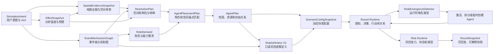

# Agent 整体架构 V2 重构计划

## 1. 文档状态

- 计划版本：`2.1-core-implemented`
- 适用范围：Step 1 地图与背景生成、Step 2 场景生成、Step 3 推演运行、Step 4 结果分析
- 默认分析强度：`high`
- 建议实施分支：`codex/agent-runtime-v2`
- 风险对象合同：新模拟使用 Risk Object V2，历史 V1 只做兼容读取
- 本期范围：包含运行时 Agent 激活、聚合 Agent 拆分和临时 Agent 创建
- 暂不提供：运行时新增灾害变量的用户操作界面
- 前向兼容：共享合同必须支持后续 `ScenarioPatch` 注入新事件、变量和政策

### 1.1 实施进度（2026-07-13）

本计划已经完成 Agent V2 主流程的核心实施。下列完成项指共享正式流程已经具备对应数据合同、持久化和回归测试；未完成项继续作为后续增强，不得在产品文案中描述为已交付能力。

- [x] `effort-profile-v2` 五档不可变快照、四阶段预算和 V1 冻结快照兼容读取。
- [x] `BudgetLedger` 的调用前预留、真实 usage 结算、缺失 usage 按预留额结算、软硬上限和追加式条目合同。
- [x] Step 1 地图候选池、规划锚点、基础空间层级、热点下钻层级和定向细化槽位读取同一 Effort 快照。
- [x] Step 2 计划 Agent 上限和每个 Agent 初始关系候选上限读取同一 Effort 快照；普通新流程继续屏蔽手工 Agent 数量。
- [x] Step 3 运行期 Agent 涌现核心链路：能力缺口发现、连续轮次门槛、休眠唤醒、聚合拆分、临时 Agent、资源守恒、下一轮生效、谱系与候选账本。
- [x] 真实运行器已持久化 `agent_emergence_state.json`、`agent_emergence_ledger.jsonl`、`agent_lineage_ledger.jsonl` 和 `agent_candidate_ledger.jsonl`。
- [x] Step 2 已完成 `RoleDemand -> AgentArchetype -> AgentInstance` 正式规划，V2 原型决定主体类型、角色、能力、权限和资源边界，旧生成器只作为候选与证据来源。
- [x] `AgentPlan`、`PlacementPlan`、`ResolutionPlan` 和 `PolicyExecutionPlan` 已进入正式配置、风险对象作用域和 Step 2 建档审计；地点、实体与政策目标先归一化到正式区域引用。
- [x] Step 3 已完成每轮行动候选、能力/权限/资源/生命周期校验、追加式状态变更、关系事件与关系状态、政策执行、运行时 Agent 涌现和轮次快照。
- [x] 运行顺序已冻结为“到期 Agent 激活 -> 变量与扩散 -> Agent 行动 -> 关系/机制传播 -> 政策执行 -> 反馈 -> Agent 涌现 -> 快照 -> 风险涌现与刷新”，Risk Object 只读取结果。
- [x] Step 2/3 已展示角色需求覆盖、生成依据、能力权限资源、生命周期、行动结果、政策执行、动态关系与 Agent 涌现，并通过统一中文显示边界隐藏机器枚举。
- [ ] `BudgetLedger` 仍需逐一接入所有 LLM、检索和高成本规划调用，当前已完成合同与独立服务。
- [ ] Step 1 第二阶段机制定向补查、R4 内部单元证据合同和多空间假设比较仍待接入。
- [ ] 每轮新的机制端点发现仍主要消费结构化能力缺口和关系证据，尚未完成开放式机制发现与外部证据补查闭环。
- [ ] Step 4 的 Effort 预算、反事实、敏感性和预算审计仍待完整执行；武汉冻结案例的 Agent V2 数据合同迁移按既定范围延后。

本文档是 Agent V2 的实施基线。共享合同、Effort 语义、空间证据、风险对象边界、运行时顺序和迁移规则冻结后，各子模块才能并行开发。任何分支不得自行定义另一套 Effort、空间粒度、Agent 数量或风险对象反馈规则。

## 2. 重构结论

本次不能继续修补 Agent 模板选择器，也不能把 Agent 理解为地图上批量放置的节点。目标架构必须形成以下闭环：

```text
用户意图与分析强度
→ 地图证据和空间骨架
→ 场景事件链与机制图
→ 空间分辨率与角色需求
→ Agent 原型、实例档案和初始关系
→ 每轮感知、决策、行动和资源变化
→ 区域状态、关系事件和风险观察
→ 新角色需求与运行时 Agent 涌现
→ 下一轮继续推演
```

Agent 系统的职责是回答：

1. 为什么需要这个 Agent。
2. 它代表一个区域、群体、机构还是具体设施。
3. 它拥有什么能力、权限、资源和约束。
4. 它在本轮看到了什么、有哪些可执行行动、为什么选择当前行动。
5. 它的行动如何改变自身、区域、关系和风险指标。
6. 推演过程中为什么出现新的 Agent，以及新 Agent 从哪一轮开始生效。

## 3. 当前实现基线与必须替换的逻辑

### 3.1 已经可以保留的能力

- 地图候选收集与最终选点已经分离。
- 地图结果保留 `source_kind`、provider、空间精度、选择分数和选择原因。
- 正式地图种子具有 `formal_ready` 门槛，参考点和上下文不能伪装为正式空间事实。
- Agent 已有目标、能力、资源、约束、行动空间和关系等档案字段。
- Risk Object V2 已从机制路径提取风险候选，并保留机制边、区域、Agent 和证据引用。
- Risk Object V2 已与 Agent 决策解耦，风险对象 ID 不进入 Agent 候选发现和决策提示。
- 运行时已经具备 Agent 互动、动态关系、区域状态、风险张力和风险涌现记录。
- 历史 V1 风险对象和冻结案例已经有兼容读取入口。

### 3.2 必须替换的旧逻辑

- `search_mode=fast/deep_search` 不再作为新模拟的架构开关。
- 用户不再编辑 `target_agent_count`。
- 环境类型不再对应强制 Agent 数量下限。
- 不再为了达到数量区间调用补齐逻辑生成重复 Agent。
- 地图半径不能单独决定所有空间粒度。
- 地图展示上限不能裁掉 Agent 规划所需的正式证据。
- 地图子区域不能直接套固定角色模板形成完整 Agent 集。
- Agent 行动不能只按 `agent_type`、`agent_subtype` 和区域风险选择固定动作。
- 关系不能因为共处一地或共享风险对象而自动增强。
- 风险对象不能作为 Agent 的行为发动机。
- Step 4 不能重新编造 Step 3 未记录的行动理由。

### 3.3 风险对象 V2 冻结前的质量门槛

当前风险对象方向正确，但在共享合同冻结前必须保证：

- 没有机制说明和证据的纯猜测边只能标记为 `speculative`。
- 真实受体名称与地图实体名称匹配，不能单独把整条机制边升级为 `observed`。
- 风险候选必须满足一条可锚定机制边，或至少两条非降级推断边。
- 占位证据、内部变量名、悬空节点和未经验证的关系不得进入正式风险对象。
- 风险对象可以为零，不得为了界面展示补造卡片。

## 4. 已冻结的产品与架构规则

### 4.1 Effort 规则

- 产品名称统一为“分析强度”。
- 档位固定为 `light`、`medium`、`high`、`extra_high`、`ultra`。
- 默认档位为 `high`。
- 所有档位都使用事件链、机制图、Agent 档案、行动校验和风险对象 V2，不存在架构降级版“快速搜索”。
- Effort 在 Step 1 点击背景生成时锁定。
- Step 2 更换 Effort 必须重新生成地图背景、空间骨架、机制、Agent、关系和风险对象。
- Step 3 开始后不能原地换档，只能复制为新推演。
- 系统可以推荐更高档位，但不得静默升级。
- Effort 控制预算和最大细化程度，不改变用户 AOI、灾害严重度、真实时间跨度和证据门槛。
- 高 Effort 不能把缺失数据变成事实。

### 4.2 地图与空间规则

- AOI 决定分析边界，用户文本决定注意力，Effort 决定可投入的细化预算。
- 半径决定全局覆盖骨架，不能单独决定最终设施粒度。
- 用户明确点名并取得合格证据的设施可以穿透默认宏观粒度。
- 高 Effort 只在机制关键路径、热点、异质区域和高价值不确定性处细化。
- 具体设施 Agent 必须有设施证据；只有区域证据时只能生成明确标记的聚合 Agent。
- `reference`、上下文图层和合成坐标不能制造具体真实机构。
- 地图规划数据与地图渲染数据分离。渲染可以折叠或抽样，规划证据不能被静默删除。

### 4.3 Agent 规则

- Agent 不是独立起点，必须消费 `ScenarioPlanningInput`。
- Agent 模块不能自行重新解释灾害机制。
- Agent 数量由角色覆盖、空间分辨率、证据和预算共同推导。
- 高优先级 RoleDemand 必须得到覆盖结果或明确的未覆盖原因。
- 同一 Agent 可以覆盖多个兼容 RoleDemand，防止重复生成。
- 只有空间、容量、资源或治理独立性会改变结果时，才拆成多个同类 Agent。
- 档案、实例初始值和逐轮运行状态严格分离。
- 运行时新 Agent 本轮发现、轮末建档、下一轮才参与行动。
- 历史 Agent 不删除，只能转为 `dormant`、`merged` 或 `retired`。

### 4.4 风险对象规则

- 风险对象是只读观察和归因层，不参与 Agent 候选发现、决策提示、状态增量、传播系数和机制传播。
- 风险对象、Agent 和政策共同引用统一的 `ScenarioStateSchema`，不互相复制状态。
- Agent 行动改变统一状态变量，风险对象读取这些变量形成观察。
- 风险对象最多八个处于活跃状态，此上限不随 Effort 改变。
- 风险成立阈值、升级阈值和证据门槛不随 Effort 改变。
- 运行时风险涌现不能直接补造 Agent，只能记录能力缺口或角色缺口。
- 角色缺口交给运行时 Agent 涌现流程独立判断。

### 4.5 运行时新增 Agent 规则

- 新关系本身不能直接创建 Agent。
- 只有新机制端点、持续能力缺口、明确未覆盖 RoleDemand 或聚合 Agent 内部出现实质异质性时，才能产生 `EmergentRoleDemand`。
- 固定解析顺序为：激活休眠 Agent、拆分聚合 Agent、创建临时 Agent。
- 聚合拆分只允许发生在需求与父 Agent 属于同一 `AgentArchetype` 时；跨原型缺口不得继承不相关主体的身份、档案、权限和资源，必须进入临时 Agent 路径。
- 运行时创建的 Agent 必须带创建轮次、触发依据、证据、置信度、来源场景版本和预算记录。
- 临时 Agent 默认是 `provisional`，不能因推断身份自动获得不可逆或高权限行动能力。
- 运行时新增 Agent 不回写历史轮次，不假装此前已经存在。

## 5. 目标架构



## 6. 共享合同与所有权

共享合同不归 Agent 分支、地图分支或风险分支单独所有。建议建立中立目录：

```text
backend/app/services/scenario_planning/
```

该目录负责：

- 合同版本和 ID 规则
- Effort 注册表和预算编译
- 空间分辨率枚举
- 场景状态变量注册
- ArtifactRef 和版本引用
- ScenarioPlanningInput
- ScenarioConfigSnapshot
- RoundSnapshot
- 兼容迁移规则

地图、机制、Agent、政策、风险和报告模块通过这些合同集成，不得重复声明同名结构。

## 7. Effort 与预算架构

### 7.1 EffortSnapshot

```ts
interface EffortSnapshot {
  snapshot_id: string
  level: "light" | "medium" | "high" | "extra_high" | "ultra"
  profile_version: string
  source: "user" | "default" | "legacy_migration" | "legacy_frozen"
  selected_at: string
  locked_at: string
  budget_multiplier: number
  recommended_total_token_min: number
  recommended_total_token_max: number
  stage_budgets: {
    step1: StageBudget
    step2: StageBudget
    step3: StageBudget
    step4: StageBudget
  }
  content_hash: string
}
```

建议 Token 上限是产品初始预算范围，不是计费承诺。预算统计包含可观测输入、输出和 reasoning token；供应商无法返回真实 usage 时，按调用前预留上限结算。

### 7.2 StageBudget

```ts
interface StageBudget {
  stage: "step1" | "step2" | "step3" | "step4"
  token_soft_limit: number
  token_hard_limit: number
  call_limit: number
  concurrency_limit: number
  timeout_seconds: number
  operation_limits: Record<string, number>
  degradation_order: string[]
}
```

### 7.3 BudgetLedger

每次模型、检索和高成本规划操作都执行：

```text
调用前预留预算
→ 执行操作
→ 读取真实 usage
→ 结算或释放预算
→ 追加 BudgetLedger
```

账本至少记录：

- `budget_entry_id`
- `effort_snapshot_ref`
- `stage`
- `round_number`
- `operation`
- `model_or_provider`
- `input_tokens`
- `output_tokens`
- `reasoning_tokens`
- `reserved_tokens`
- `duration_ms`
- `status`
- `produced_artifact_refs`
- `degradation_applied`
- `stop_reason`
- `created_at`

### 7.4 固定降级顺序

预算趋紧时按以下顺序降级：

1. 减少外围 Agent 的候选行动。
2. 缩短外围 Agent 的关系搜索。
3. 使用缓存和确定性轻量策略处理外围 Agent。
4. 减少替代机制解释和非关键反事实。
5. 延迟低优先级空间细化。
6. 保留关键 Agent、核心机制、证据校验和状态快照。

预算耗尽不能静默突破，也不能删除关键角色。系统必须记录降级原因和未完成需求。

## 8. 空间分辨率与地图合同

### 8.1 空间层级

| 层级 | 名称 | 典型对象 |
| --- | --- | --- |
| `R0` | AOI 与城市区域 | 整个分析圈、城市群、跨区域范围 |
| `R1` | 区域与系统走廊 | 区县、流域、海岸带、生态带、交通走廊 |
| `R2` | 功能片区 | 街道、社区、工业片区、港区、服务片区 |
| `R3` | 具体设施与机构 | 医院、学校、核电站、工厂、避难所、监测站 |
| `R4` | 内部单元与细分群体 | ICU、厂区单元、供应节点、特定居民群体、关键资源池 |

R4 不等于地图必须拥有建筑内部坐标。它表示推演需要把一个具体设施或聚合主体进一步拆成具有独立资源、状态和行动逻辑的单元。

### 8.2 两阶段地图规划

地图不能只在 Step 1 做一次固定选点。正式流程分为两次：

#### 阶段一：SpatialSkeletonPlan

输入：

- AOI 与半径
- 用户点名地点和关注文本
- 初始灾害描述
- EffortSnapshot
- 数据源可用性

输出：

- 覆盖整个 AOI 的宏观骨架
- 用户明确点名的合格地点
- 环境、设施、行政和交通类别覆盖
- 数据质量与缺口
- 可供 Step 2 使用的正式空间证据快照

#### 阶段二：MechanismAwareSpatialRefinement

输入：

- SpatialEvidenceSnapshot
- EventMechanismGraph
- RoleDemand
- PolicyPlan
- 剩余 Step 2 预算

输出：

- 机制关键路径上的定向设施补查
- 高影响区域的空间细化
- 需要具体设施还是聚合主体的决策
- 无法取得证据的空间缺口
- 最终 ResolutionPlan

例如“台风导致核泄漏”在第二阶段应定向确认核电设施、海岸和大气传播载体、医院、应急机构、监测设施和可能受影响生计群体，而不是扫描 AOI 内所有 POI。

### 8.3 SpatialEvidenceSnapshot

```ts
interface SpatialEvidenceSnapshot {
  snapshot_id: string
  contract_version: string
  effort_snapshot_ref: ArtifactRef
  aoi: AreaOfInterest
  base_granularity: "R0" | "R1" | "R2" | "R3" | "R4"
  max_supported_granularity: "R0" | "R1" | "R2" | "R3" | "R4"
  selected_features: SpatialEvidenceFeature[]
  unresolved_focuses: UnresolvedSpatialFocus[]
  data_quality: SpatialDataQuality
  selection_audit: SpatialSelectionAudit
  budget_usage_ref: ArtifactRef
  content_hash: string
}
```

`selected_features` 是规划权威集合。图谱或地图 UI 可以通过 `render_visibility` 折叠显示，但 Agent、区域和风险模块必须读取完整规划集合。

### 8.4 空间细化评分

```text
refine_score =
  问题相关性
  × 机制中心性
  × 潜在影响
  × 区域异质性
  × 不确定性降低收益
  × 证据充分度
  ÷ 预计成本
```

细化还必须满足：

- 不突破 Effort 的最大空间层级。
- 不突破 Step 1 或 Step 2 空间预算。
- 不超过数据证据支持层级。
- 父子对象的资源、人口和风险不能重复计算。
- 用户点名设施若未取得证据，记录为 unresolved，不能生成同名真实 Agent。

## 9. ResolutionPlan

输入：

- SpatialEvidenceSnapshot
- EventMechanismGraph
- TemporalPlan
- RoleDemand[]
- PolicyPlan
- EffortSnapshot

输出：

```ts
interface ResolutionPlan {
  resolution_plan_id: string
  effort_snapshot_ref: ArtifactRef
  spatial_evidence_ref: ArtifactRef
  event_graph_ref: ArtifactRef
  coverage_units: CoverageUnitPlan[]
  refinement_decisions: RefinementDecision[]
  role_resolution_requirements: RoleResolutionRequirement[]
  unresolved_evidence_gaps: EvidenceGap[]
  estimated_cost: PlanningCostEstimate
  stop_conditions: StopCondition[]
  generation_audit: GenerationAudit
  content_hash: string
}
```

关键规则：

- 事件直接作用于具体设施时，优先尝试 R3 设施级建模。
- 只有区域证据时，使用 R1 或 R2 聚合 Agent。
- 同类低优先级群体可以聚合。
- 高优先级角色必须覆盖或报告缺口。
- Effort 只限定细化上限，不改变事件事实。
- 不允许为了达到数量目标重复生成同类 Agent。
- 达到预算上限、证据上限或边际信息增益阈值后停止细化。

## 10. RoleDemand 与地图锚点匹配

### 10.1 RoleDemand

RoleDemand 由事件机制、政策和服务依赖提出，不由 Agent 生成器自由猜测。

```ts
interface RoleDemand {
  role_demand_id: string
  role_key: string
  label_zh: string
  source_type: "mechanism" | "policy" | "service_dependency" | "runtime_emergence"
  source_refs: ArtifactRef[]
  required_capabilities: string[]
  required_permissions: string[]
  required_resource_types: string[]
  jurisdiction_region_ids: string[]
  affected_region_ids: string[]
  activation_phase: string
  priority: "critical" | "high" | "medium" | "low"
  representation_requirement: "aggregate_allowed" | "institution_required" | "facility_required" | "subunit_required"
  multiplicity_rule: "single" | "per_region" | "per_independent_capacity" | "adaptive"
  evidence_requirements: string[]
}
```

### 10.2 SpatialAnchorCandidate

```ts
interface SpatialAnchorCandidate {
  anchor_id: string
  spatial_feature_ref: ArtifactRef
  display_name_zh: string
  region_id: string
  resolution_level: "R0" | "R1" | "R2" | "R3" | "R4"
  supported_role_keys: string[]
  source_kind: "observed" | "detected" | "reference" | "inferred"
  evidence_grade: "formal" | "contextual" | "reference_only" | "synthetic"
  spatial_precision: "exact" | "site_approximate" | "area_only" | "non_geographic"
  evidence_refs: ArtifactRef[]
  capacity_hints: Record<string, number>
}
```

### 10.3 AgentPlacementPlan

匹配目标不是生成最多 Agent，而是在预算内满足高价值角色覆盖：

```text
最小化：
  总建模成本
  + 未覆盖高优先级角色惩罚
  + 过度聚合惩罚
  + 无证据具体化惩罚
  + 重复 Agent 惩罚
```

匹配规则：

- 核电设施运营方必须匹配核电设施或明确的核工业设施证据。
- 医院具体实例必须匹配医疗设施证据。
- 地方政府可由行政区划和管辖证据建立，不强制要求政府楼宇 POI。
- 同一家医院可以覆盖医疗救治、伤员接收和应急协作等兼容需求。
- 多家同类设施只有在容量独立、空间隔离或资源差异会改变结果时才分别建模。
- 没有具体设施证据但允许聚合时，生成带 `area_only` 的区域服务体系 Agent。
- 不允许聚合且证据不足时，写入 `UnresolvedDemand`。

## 11. Agent 三层模型

### 11.1 AgentArchetype

定义角色稳定能力，不保存具体场景状态：

```ts
interface AgentArchetype {
  archetype_key: string
  version: string
  label_zh: string
  capabilities: string[]
  permissions: string[]
  resource_types: string[]
  available_action_keys: string[]
  decision_constraints: string[]
  relationship_roles: string[]
  observable_state_keys: string[]
  default_uncertainty_bounds: Record<string, [number, number]>
}
```

首批原型至少覆盖：

- 地方政府
- 行业监管机构
- 核电或工业设施运营方
- 医院和区域医疗服务体系
- 环境监测机构
- 应急救援机构
- 交通和基础设施运营方
- 居民群体
- 渔业或农业群体
- 社区及社会组织
- 物资供应与物流主体
- 媒体和信息发布主体

### 11.2 AgentInstanceProfile

定义具体场景中的初始档案：

```ts
interface AgentInstanceProfile {
  agent_id: string
  archetype_key: string
  display_name_zh: string
  lifecycle_status: "planned" | "dormant" | "active" | "provisional" | "merged" | "retired"
  representation_level: "region_aggregate" | "group_representative" | "institution" | "facility" | "subunit"
  primary_region_id: string
  coverage_region_ids: string[]
  spatial_anchor_refs: ArtifactRef[]
  represented_entity_ids: string[]
  parent_agent_id: string | null
  aggregation_weight: number
  spatial_precision: "exact" | "site_approximate" | "area_only" | "non_geographic"
  role_demand_refs: ArtifactRef[]
  evidence_refs: ArtifactRef[]
  initial_resources: Record<string, number>
  resource_uncertainty: Record<string, [number, number]>
  initial_goals: GoalDefinition[]
  initial_constraints: ConstraintDefinition[]
  initial_relationship_refs: ArtifactRef[]
  activation_triggers: TriggerCondition[]
  created_round: number
  activation_round: number | null
  scenario_version_ref: ArtifactRef
  confidence: number
  generation_reason: string
  generation_mode: "prepare_planned" | "runtime_activated" | "runtime_split" | "runtime_provisional"
}
```

### 11.3 AgentRuntimeState

```ts
interface AgentRuntimeState {
  agent_id: string
  round_number: number
  lifecycle_status: "dormant" | "active" | "provisional" | "merged" | "retired"
  available_resources: Record<string, number>
  committed_resources: Record<string, number>
  current_goals: GoalState[]
  active_constraints: ConstraintState[]
  observations: ObservationRecord[]
  belief_state: Record<string, number>
  uncertainty_state: Record<string, number>
  awareness_lag: number
  recent_action_refs: ArtifactRef[]
  relationship_state_refs: ArtifactRef[]
  region_state_ref: ArtifactRef
  known_scenario_version_ref: ArtifactRef
}
```

Agent 不保存 `risk_object_ids` 作为行为输入。原计划中的 `risk_perception` 改为对底层灾害、环境、服务和社会状态的 `observations` 与 `belief_state`。

## 12. AgentPlan

```ts
interface AgentPlan {
  agent_plan_id: string
  contract_version: string
  resolution_plan_ref: ArtifactRef
  event_graph_ref: ArtifactRef
  effort_snapshot_ref: ArtifactRef
  placement_plan_ref: ArtifactRef
  planned_agents: AgentInstanceProfile[]
  dormant_agents: AgentInstanceProfile[]
  role_coverage: RoleCoverage[]
  unresolved_demands: UnresolvedDemand[]
  relationship_demands: RelationshipDemand[]
  generation_audit: GenerationAudit
  content_hash: string
}
```

要求：

- 所有 critical 和 high RoleDemand 必须有覆盖结果。
- 无法覆盖时记录真实缺口。
- 不能创建无证据具体 Agent 假装覆盖。
- 同一输入、合同版本、Effort 和随机种子必须可复现。
- Agent 数量是推导结果，不接受 `target_agent_count`。
- 休眠 Agent 只用于已知但初期不活跃的角色，不是隐藏的数量填充池。

## 13. 行动系统

### 13.1 ActionDefinition

```ts
interface ActionDefinition {
  action_key: string
  version: string
  label_zh: string
  required_capabilities: string[]
  required_permissions: string[]
  resource_cost: Record<string, number>
  target_types: string[]
  preconditions: TriggerCondition[]
  state_effect_templates: StateEffectTemplate[]
  relationship_effect_templates: RelationshipEffectTemplate[]
  failure_effect_templates: StateEffectTemplate[]
  irreversible: boolean
  provisional_agent_allowed: boolean
  explanation_schema: string[]
}
```

### 13.2 每轮决策顺序

1. 读取本轮场景版本和 Agent 已知状态。
2. 感知可观测区域、机制、关系和政策状态。
3. 从原型行动库生成候选行动。
4. 校验能力、权限、资源、目标和场景前置条件。
5. 计算行动对目标、资源、信任和约束的预期影响。
6. 在 Effort 预算内选择确定性策略或深度推理。
7. 执行动作并生成成功、部分成功或失败结果。
8. 写入资源变化、状态变化和关系事件。
9. 保存完整决策解释链。

LLM 可以排序已经校验的候选行动和生成中文解释，但不能创造未注册行动，也不能直接写入任意状态增量。

### 13.3 StateMutationRecord

```ts
interface StateMutationRecord {
  mutation_id: string
  round_number: number
  source_type: "agent_action" | "policy_execution" | "mechanism_propagation" | "scenario_patch"
  source_ref: ArtifactRef
  target_type: "agent" | "region" | "mechanism" | "relationship" | "resource_pool"
  target_id: string
  state_key: string
  previous_value: number | string | boolean
  next_value: number | string | boolean
  delta: number | null
  evidence_refs: ArtifactRef[]
  scenario_version_ref: ArtifactRef
}
```

风险对象、报告和回放只能读取这些已记录的状态变化，不能重新计算一套不同结果。

## 14. 政策执行者绑定

PolicyPlan 提供：

- `policy_id`
- `executor_capability_keys`
- `required_permissions`
- `resource_requirements`
- `target_refs`
- `trigger_conditions`
- `latency`
- `duration`
- `intended_state_effects`
- `side_effects`

绑定依据：

- Agent 能力
- Agent 权限
- 管辖区域
- 当前资源
- 行动前置条件
- 政策目标对象
- Agent 生命周期状态

输出：

- `executor_agent_ids`
- `capability_match`
- `permission_match`
- `resource_match`
- `binding_reason`
- `unresolved_constraints`

没有符合条件的执行者时：

- 保留政策计划。
- 标记执行能力缺口。
- 在准备阶段可生成新的 RoleDemand。
- 运行阶段交给 RoleEmergenceDetector 判断。
- 不自动创建一个万能政府 Agent。
- 不虚构政策已经成功执行。

## 15. 关系系统

### 15.1 RelationshipContract

定义初始稳定关系：

- 监管
- 隶属
- 供应
- 服务
- 转诊
- 信息报告
- 应急协调
- 空间依赖
- 资金依赖
- 运输依赖

合同至少包含：

- `relationship_contract_id`
- `source_agent_id`
- `target_agent_id`
- `relationship_type`
- `direction`
- `scope`
- `trigger_conditions`
- `latency_rounds`
- `mechanism_edge_ids`
- `evidence_refs`
- `epistemic_status`
- `initial_strength`
- `initial_trust`
- `initial_dependency`

### 15.2 RelationshipEvent

运行事件包括请求、接受、拒绝、协作、资源转移、信息披露、冲突、违约、救援、补偿、关系激活和关系中断。

```ts
interface RelationshipEvent {
  relationship_event_id: string
  round_number: number
  event_type: string
  source_agent_id: string
  target_agent_id: string
  source_action_ref: ArtifactRef | null
  mechanism_edge_ids: string[]
  state_mutation_refs: ArtifactRef[]
  evidence_refs: ArtifactRef[]
  resource_transfer: Record<string, number>
  success_status: "success" | "partial" | "failed"
  scenario_version_ref: ArtifactRef
  summary_zh: string
}
```

### 15.3 RelationshipState

累计状态至少包括：

- `trust`
- `dependency`
- `coordination`
- `tension`
- `resource_balance`
- `information_reliability`
- `unfulfilled_commitments`
- `last_event_ref`
- `active_since_round`
- `last_updated_round`

关系变化必须来自 RelationshipEvent。空间邻近只能产生关系候选，不能直接改变关系状态。

## 16. Risk Object V2 接入

### 16.1 准备阶段顺序

```text
SpatialEvidenceSnapshot
→ EventMechanismGraph
→ RoleDemand
→ ResolutionPlan
→ AgentPlan
→ ValidatedRelationshipGraph
→ RiskCandidateExtraction
→ RiskDefinition V2
→ ScenarioConfigSnapshot
```

AgentPlan 必须在风险定义之前稳定以下引用：

- `agent_id`
- `role_demand_refs`
- `region_id`
- `spatial_anchor_refs`
- `mechanism_edge_ids`
- `relationship_contract_id`
- `evidence_refs`

### 16.2 运行阶段顺序

```text
AgentActionRecord
→ StateMutationRecord
→ RelationshipEvent
→ ScenarioStateSchema 对应状态更新
→ RoleEmergenceDetector
→ RiskEmergenceDetector
→ RiskRuntimeTracker
→ RoundSnapshot
```

风险对象可以引用 Agent 作为受影响主体或响应主体，但 Agent 不读取风险对象 ID。二者通过底层状态指标和机制边连接。

### 16.3 Effort 对风险对象的合法影响

允许改变：

- 候选机制路径扫描数量
- 替代路径数量
- 跨区域反馈环搜索预算
- 证据交叉验证次数
- 运行时涌现候选扫描预算
- Step 4 替代解释和反事实深度

不允许改变：

- 最低证据充分度
- 风险成立逻辑
- `watch`、`elevated`、`critical` 阈值
- 最多八个活跃风险对象
- 风险对象只读规则
- 风险对象不得驱动 Agent 的规则

## 17. 运行时 Agent 涌现

### 17.1 目标

运行时 Agent 涌现用于处理三类真实需求：

1. 初始场景已经知道该角色，但它在早期不活跃，后续条件满足时需要激活。
2. 聚合 Agent 在推演中出现显著内部差异，需要拆成独立资源和行动主体。
3. 新机制路径、持续能力缺口或新关系端点暴露出初始 AgentPlan 没有覆盖的角色。

它不是为了让关系图变得更密，也不是每发现一个关系候选就创造一个 Agent。

### 17.2 EmergentRoleDemand

```ts
interface EmergentRoleDemand {
  emergent_role_demand_id: string
  signature: string
  first_seen_round: number
  last_seen_round: number
  consecutive_rounds: number
  source_type: "mechanism_endpoint" | "capability_gap" | "relationship_endpoint" | "aggregate_heterogeneity"
  source_refs: ArtifactRef[]
  role_key: string
  required_capabilities: string[]
  required_permissions: string[]
  target_region_ids: string[]
  spatial_anchor_refs: ArtifactRef[]
  evidence_strength_score: number
  impact_score: number
  priority_score: number
  resolution_status: "pending" | "activated_existing" | "split_aggregate" | "created_provisional" | "rejected" | "budget_deferred"
  resolution_reason: string
}
```

稳定签名由场景版本、角色、管辖区域、空间锚点和机制边集合构成，防止同一缺口每轮重复创建 Agent。

### 17.3 触发门槛

普通触发必须满足：

- 连续两轮出现同一稳定签名。
- 至少一个明确的机制端点、能力缺口或关系端点。
- 证据充分度不低于 60。
- 影响分不低于 50。
- 当前 AgentPlan 中没有可覆盖的活跃、休眠或聚合 Agent。
- 未达到当前 Effort 的运行时新增 Agent 上限。

立即触发必须同时满足：

- 证据充分度不低于 80。
- 影响分不低于 80。
- 角色属于关键生命安全、基础设施连续性或法定响应链路。

证据门槛不随 Effort 降低。Effort 只控制扫描范围、候选数量和创建上限。

### 17.4 固定解析顺序

#### 第一步：激活休眠 Agent

如果已有休眠 Agent 覆盖相同角色、区域、能力和证据范围：

- 将生命周期改为 `active`。
- 记录 `activation_round`。
- 恢复其已冻结的初始资源和约束。
- 不计入“新创建 Agent”数量，但计入本轮激活预算。

#### 第二步：拆分聚合 Agent

当聚合主体内部出现资源、目标、位置或行动能力差异，并且差异会改变推演结果：

- 先校验需求与父 Agent 的 `AgentArchetype` 一致；跨原型需求不得拆分。
- 创建一个或多个子 Agent。
- 设置 `parent_agent_id`。
- 按守恒规则分配父 Agent 的资源、覆盖权重和关系责任。
- 父 Agent 转为 `merged` 或继续代表未拆分部分。
- 不得因拆分增加总人口、总资源或总服务能力。

#### 第三步：创建临时 Agent

只有前两步无法覆盖时才创建：

- 生命周期为 `provisional`。
- `created_round` 为发现轮次。
- `activation_round` 为下一轮。
- `generation_mode=runtime_provisional`。
- 档案来源于 Archetype、RoleDemand、空间证据和当前场景状态。
- 缺少真实容量数据时使用有上下界的相对资源，禁止编造精确数值。
- 高权限、不可逆行动必须有明确权限证据；否则保持能力缺口。

### 17.5 新 Agent 的关系初始化

新 Agent 只建立支撑其出现的最小关系集合：

- 触发它出现的关系端点
- 法定隶属或监管关系
- 必要服务、供应或信息关系
- 与父聚合 Agent 的拆分关系

不得在创建时为它补齐一张稠密社交网络。其余关系在后续轮次通过正常候选发现和 RelationshipEvent 建立。

### 17.6 生命周期结束

- 连续多轮不再满足激活条件时可转为 `dormant`。
- 临时任务完成后可转为 `retired`。
- 被新的具体 Agent 替代时可转为 `merged`。
- 历史快照和关系事件永久保留。
- 生命周期变化不能回写旧快照。

## 18. Step 3 完整逐轮协议

每轮固定执行：

1. 读取当前 ScenarioConfigSnapshot 和场景版本。
2. 应用已确认且计划在本轮生效的 ScenarioPatch。
3. 激活本轮已有 Agent，并推进动态关系生命周期。
4. 计算环境扩散、机制传播和区域状态。
5. Agent 感知可观测状态和关系。
6. 生成、校验、选择并执行 Agent 行动。
7. 执行已绑定政策及副作用。
8. 写入 StateMutationRecord 和 RelationshipEvent。
9. 更新 Agent、区域、机制和关系状态。
10. 生成本轮预观察快照。
11. 运行 RoleEmergenceDetector。
12. 激活休眠 Agent、拆分聚合 Agent或创建临时 Agent，新增主体下一轮生效。
13. 运行 RiskEmergenceDetector。
14. 运行 RiskRuntimeTracker 并生成风险事件。
15. 写入 RoundSnapshot、BudgetLedger 和解释记录。

Step 3 不允许：

- 修改 Effort。
- 回写历史轮次。
- 因预算不足删除关键 Agent。
- 让本轮末新建的 Agent 回到本轮执行行动。
- 让 Step 4 推测写回运行状态。
- 让风险对象直接生成 Agent。

## 19. RoundSnapshot

```ts
interface RoundSnapshot {
  snapshot_id: string
  run_id: string
  round_number: number
  simulated_time: string
  scenario_config_ref: ArtifactRef
  scenario_version_ref: ArtifactRef
  effort_snapshot_ref: ArtifactRef
  resolution_plan_ref: ArtifactRef
  budget_ledger_ref: ArtifactRef
  mechanism_states: MechanismState[]
  region_states: RegionState[]
  agent_states: AgentRuntimeState[]
  agent_lifecycle_events: AgentLifecycleEvent[]
  action_records: AgentActionRecord[]
  state_mutation_records: StateMutationRecord[]
  relationship_events: RelationshipEvent[]
  relationship_states: RelationshipState[]
  policy_executions: PolicyExecutionRecord[]
  emergent_role_demands: EmergentRoleDemand[]
  risk_definition_version_ref: ArtifactRef
  risk_observations: RiskObservation[]
  risk_events: RiskEvent[]
  degradation_records: DegradationRecord[]
  content_hash: string
}
```

Step 4 所有 Agent、关系、政策和风险解释必须来自 RoundSnapshot 或其引用的追加式事件，不得重新生成事实。

## 20. 前端产品调整

### 20.1 Step 1

显示：

- 分析强度五档选择
- 默认 High 推荐
- 当前档位的用户理解
- 预计成本范围
- 复合灾害时的升档建议
- 点击背景生成后的锁定状态

不显示：

- Agent 数量
- 地图节点数量
- 模型调用次数
- 内部 Token 细项

### 20.2 Step 2

普通模式显示：

- 系统理解的事件链
- 空间覆盖和重点细化区域
- Agent 角色覆盖摘要
- 未覆盖角色和证据缺口
- 风险对象、区域、Agent 和关系四个结果页
- 当前 Effort 和预计剩余预算

Agent 详情显示：

- 表示层级
- 空间锚点与精度
- 生成原因和 RoleDemand
- 初始目标、资源、能力、权限和约束
- 可执行行动
- 初始关系
- 证据和置信度

高级模式可以查看 ResolutionPlan、聚合规则、空间细化理由和预算审计，但不开放 Agent 数量编辑。

### 20.3 Step 3

Agent 工作台增加：

- 初始状态与当前状态对比
- 本轮观察
- 候选行动及淘汰原因
- 最终行动、成本、目标和结果
- 资源变化
- 关系变化及来源事件
- 生命周期状态
- “准备阶段生成”“运行时激活”“聚合拆分”“运行时新增”标识
- 新 Agent 的创建轮次、证据和下一轮生效提示

关系与风险页增加：

- 关系事件原因
- 机制边引用
- 风险对象的底层监测指标
- 风险涌现和 Agent 涌现的时间关系
- 明确提示风险对象不是 Agent 决策输入

### 20.4 Step 4

报告至少包含：

- Agent 角色覆盖和缺口
- 关键 Agent 行动链
- 资源消耗和能力瓶颈
- 关系建立、增强、减弱和中断原因
- 运行时新增 Agent 及其影响
- 风险状态与底层指标变化
- Effort、预算使用、降级记录和未完成分析
- 证据充分度、替代解释和反事实结果

## 21. 实施阶段

### 阶段 A：共享合同和 Effort

交付：

- `scenario_planning` 中立合同模块
- ContractEnvelope 和 ArtifactRef
- EffortSnapshot 和五档注册表
- StageBudget 和 BudgetLedger
- ScenarioStateSchema
- 旧 `search_mode` 和 Agent 数量参数兼容读取
- 共享 fixtures 和合同测试

完成门槛：地图、机制、Agent、风险和前端能读取同一 EffortSnapshot。

### 阶段 B：地图与 ResolutionPlan

交付：

- SpatialEvidenceSnapshot
- SpatialSkeletonPlan
- MechanismAwareSpatialRefinement
- R0 至 R4 空间层级
- 规划数据与渲染数据分离
- ResolutionPlan
- 父子区域守恒和停止条件

完成门槛：相同 AOI 在不同 Effort 下产生可解释、受证据约束的不同细化结果。

### 阶段 C：Agent 规划

交付：

- RoleDemand
- SpatialAnchorCandidate
- AgentPlacementPlan
- AgentArchetype
- AgentInstanceProfile
- AgentPlan
- 角色覆盖和未覆盖审计
- 医院完整纵向案例

完成门槛：不再读取用户目标 Agent 数量，不再按环境类型补齐数量。

### 阶段 D：政策、行动和关系

交付：

- 政策执行者绑定
- ActionDefinition
- StateMutationRecord
- RelationshipContract
- RelationshipEvent
- RelationshipState
- 能力、权限、资源和失败校验

完成门槛：同一医院在不同资源条件下选择不同的合法行动，所有关系变化均有事件来源。

### 阶段 E：运行时 Agent 涌现

交付：

- EmergentRoleDemand
- RoleEmergenceDetector
- 休眠 Agent 激活
- 聚合 Agent 拆分与资源守恒
- 临时 Agent 创建
- 生命周期事件和下一轮生效规则
- Effort 级运行时新增上限

完成门槛：新关系端点或能力缺口能够受控产生新 Agent，同时不会因普通关系增长无限增殖。

### 阶段 F：风险对象和运行时集成

交付：

- Risk V2 引用 AgentPlan 和关系机制边
- Agent、风险共同读取 ScenarioStateSchema
- 风险证据门槛缺口修复
- RiskEmergenceDetector 与 RoleEmergenceDetector 固定顺序
- RoundSnapshot 完整记录

完成门槛：风险对象能观察 Agent 行动后的状态变化，但不进入 Agent 决策输入。

### 阶段 G：前端、报告和迁移

交付：

- Step 1 分析强度选择与锁定
- Step 2 空间、Agent 和证据解释
- Step 3 Agent 生命周期与行动解释
- Step 4 归因、反事实和预算报告（尚待完整执行）
- 历史模拟兼容
- 武汉冻结案例保持 V1 兼容；未来统一迁移时提升 golden artifact contract version
- 中文显示泄漏检查

完成门槛：正式流程和冻结案例共用组件、API 和投影合同；冻结案例的数据升级不在本轮执行。

## 22. 迁移规则

### 22.1 旧参数

- 新模拟不再产生 `target_agent_count`。
- 旧模拟保留原值，仅用于历史回放。
- `search_mode` 在新模拟中由 EffortSnapshot 替代。
- 旧 `fast` 和 `deep_search` 不自动重写为新档位，读取时标记 `legacy_frozen`。
- 重新准备旧模拟时创建新的 V2 配置，不覆盖旧 artifacts。

### 22.2 地图逻辑

- 固定 `spatial_feature_limit` 和 `graph_feature_limit` 迁移到 Effort 注册表。
- 武汉夹具的特殊 profile 只保留为版本化 fixture，不再代表正式产品逻辑。
- `selection_summary` 迁移为 SpatialEvidenceSnapshot 的一部分。
- Agent 规划读取完整 selected features，不读取被 UI 截断的图谱子集。

### 22.3 Agent 逻辑

- `target_count_range` 仅用于旧 artifact 解释，不参与新生成。
- `_supplement_map_agent_candidates` 从新流程移除。
- 原有地图模板候选可作为 Archetype 和 RoleDemand 匹配的兼容输入，不能直接形成最终 AgentPlan。
- 旧 AgentProfile 通过适配器映射到 `legacy_frozen` 实例档案。

### 22.4 风险对象

- 无 `risk_contract_version` 的 artifact 按 V1 读取。
- V2 风险定义保持只读。
- 新 Agent 出现后可以被后续风险对象引用，但不能改写旧风险定义和旧轮次。
- 风险候选账本、Agent 涌现账本和 BudgetLedger 均为追加式记录。

## 23. 测试与验收

### 23.1 地图与 Effort

- 同一 AOI、同一输入和同一随机种子可复现。
- 更高 Effort 不减少已经验证的关键空间锚点。
- 更高 Effort 只增加有证据或高价值不确定性的细化。
- 50 km AOI 不因 Ultra 自动生成所有街道和设施。
- 用户点名的合格设施在 Light 下仍可保留。
- 地图渲染裁剪不影响 Agent 规划证据。
- 父子区域不存在人口、资源和风险重复计算。

### 23.2 Agent 规划

- 所有 critical RoleDemand 有覆盖或明确缺口。
- 同一设施不会因多个 RoleDemand 重复生成。
- 具体医院必须有设施证据。
- 缺少具体医院证据时只能生成区域医疗聚合 Agent。
- 不再存在强制 Agent 数量下限。
- 高 Effort 不机械增加 Agent。

### 23.3 行动和关系

- 行动必须通过能力、权限、资源、目标和前置条件校验。
- 失败行动产生状态和关系结果。
- 同一医院在资源充足和资源紧缺时选择不同动作。
- 关系变化必须有 RelationshipEvent。
- 关系事件能追溯到行动、机制和证据。

### 23.4 运行时新增 Agent

- 普通新关系候选不能直接创建 Agent。
- 同一 EmergentRoleDemand 不会每轮重复创建。
- 优先激活已有休眠 Agent。
- 聚合拆分遵守人口和资源守恒。
- 临时 Agent 本轮创建、下一轮行动。
- 临时 Agent 缺少权限证据时不能执行高权限行动。
- 达到 Effort 上限后记录 `budget_deferred`，不能突破预算。
- 退役或合并 Agent 的历史状态仍可回放。

### 23.5 风险对象

- 纯 speculative 路径不能生成风险对象。
- Agent 行动通过统一状态指标改变风险观察。
- 风险对象 ID 不进入 Agent prompt。
- 风险对象不产生 Agent 关系候选。
- 风险涌现与 Agent 涌现分别记录并保持因果顺序。
- 零风险对象场景仍可运行和报告。

### 23.6 兼容与产品验证

- 旧模拟可继续回放。
- V1 artifact 不被自动重写。
- 武汉冻结案例和正式流程共用生产组件。
- Step 1 至 Step 4 不显示英文类名、snake_case 枚举和内部 ID。
- 类型检查、后端测试、前端构建和浏览器验证全部通过。

## 24. 联合纵向验收案例

统一使用“台风导致核泄漏”验证全链路：

```text
台风登陆
→ 风暴潮和厂区进水
→ 外部电源与冷却系统失效
→ 放射性物质释放
→ 海洋与大气传播分支
→ 居民、医院、渔业和基础设施承压
→ 疏散、监测、禁捕、补偿和修复
```

初始 Agent 至少覆盖：

- 核电设施运营方
- 核安全监管机构
- 地方政府
- 环境监测机构
- 医院或区域医疗服务体系
- 应急救援机构
- 居民及疏散组织
- 渔业群体
- 物资和交通保障主体

运行时验证：

- 初期未激活的医疗或救援 Agent 在触发条件满足后激活。
- 医疗聚合 Agent 因两个区域资源差异显著而拆分。
- 新的跨区域物资需求暴露出未覆盖供应主体时，形成 EmergentRoleDemand。
- 通过两轮证据门槛后创建临时供应 Agent，下一轮参与行动。
- 新 Agent 只建立供应请求、监管和运输等必要关系。
- 风险对象引用新增主体和新机制路径，但不反向控制其行动。
- Step 4 能解释新 Agent 为什么出现、何时生效、改变了哪些关系和结果。

## 25. 完成标准

重构完成必须同时满足：

- Effort 从 Step 1 锁定并贯穿四个步骤。
- 地图、机制、Agent、风险和报告读取同一 EffortSnapshot。
- 空间规划证据与地图渲染不再因数量裁剪而分叉。
- Agent 数量来自角色覆盖和分辨率，不来自用户输入或数量补齐。
- 档案、原型和运行状态完全分离。
- 每个 Agent 能追溯到 RoleDemand、空间证据和场景版本。
- 每个行动经过能力、权限、资源和前置条件校验。
- 每个状态变化具有 StateMutationRecord。
- 每个关系变化具有 RelationshipEvent。
- 运行时可以激活、拆分和临时创建 Agent。
- 新 Agent 具有证据门槛、预算上限、稳定签名和下一轮生效规则。
- 风险对象只观察底层状态，不参与 Agent 决策。
- 任一 Agent、行动、关系和风险结论都能回放和解释。
- 旧模拟和武汉冻结案例可通过兼容层继续使用。

## 26. Effort 五档全流程限制总表

下表是第一版产品预算基线。数值表示硬上限或建议范围，不是必须达到的生成数量。地图选择、Step 2 规划、Step 3 推理/关系/涌现的操作上限已经由同一 EffortSnapshot 执行；Token 软硬账本尚未包住全部模型与外部检索调用，Step 4 的反事实和敏感性次数仍是待接入的正式合同。真实上线后可根据模型价格、平均任务时长和验收数据调整 `profile_version`，但同一次推演锁定后的 EffortSnapshot 不得变化。

| Effort | 用户定义与适用场景 | 总预算倍率与建议 Token 上限 | Step 1 地图、证据与空间限制 | Step 2 机制、Agent、关系与风险限制 | Step 3 每轮运行限制 | 运行时新增 Agent 限制 | Step 4 分析与报告限制 |
| --- | --- | --- | --- | --- | --- | --- | --- |
| `Light 轻量` | 快速验证一个想法；保留一条主要事件链；适合单地点、低复杂度和早期探索。仍使用完整深度架构，不使用旧快速模板。 | `0.2x`；建议整场 `80,000–200,000` token-equivalent；全链路硬账本仍待完整接入。 | 默认覆盖 `R0–R1`；允许用户点名且证据充分的关键 `R3`；规划锚点上限 `12`，候选池上限约 `36`；定向细化槽位 `2`；外部空间数据按最少必要批次调用；不得广泛扫描单体设施。 | 主要机制链 `1` 条，替代路径最多 `1` 条；计划 Agent 上限 `20`，以区域聚合和角色代表为主；每个 Agent 初始关系候选上限 `4`；风险候选扫描上限 `24`，活跃风险仍最多 `8`；LLM 主要用于关键角色和中文解释。 | 真实时间计划不变；每轮深度推理 Agent 上限 `4`；每个深度 Agent 候选行动上限 `2`；关系搜索 `1` 跳；每轮动态关系验证上限 `8`；并行情景分支 `1`；外围 Agent 使用确定性策略。 | 先激活休眠 Agent；聚合拆分或临时创建合计最多 `1` 个；单轮最多 `1` 个；普通候选需连续两轮；立即候选仍须证据和影响均不低于 `80`；达到上限后记录缺口，不扩容。 | 证据复核 `1` 次；替代解释最多 `1` 个；反事实 `0`、政策对照 `0`、敏感性 `0`；报告聚焦主链和明确限制。 |
| `Medium 标准` | 单一灾害、局部区域和常规方案比较；适合正式讨论前的标准建模。 | `0.5x`；建议整场 `250,000–600,000` token-equivalent。 | 默认覆盖 `R1–R2`；关键机制设施允许到 `R3`；规划锚点上限 `24`，候选池上限约 `72`；定向细化槽位 `4`；每个高优先级角色可补查一个代表性设施。 | 主要机制链最多 `3` 条，替代路径最多 `2` 条；计划 Agent 上限 `50`；每个 Agent 初始关系候选上限 `8`；风险候选扫描上限 `60`；允许一次 LLM 档案复核；同类低优先级主体优先聚合。 | 每轮深度推理 Agent 上限 `10`；每个深度 Agent 候选行动上限 `3`；关系搜索 `1` 跳，关键治理链允许 `2` 跳；每轮动态关系验证上限 `24`；并行情景分支 `1`。 | 激活不计新建数；聚合拆分和临时创建整场最多 `3` 个；单轮最多 `1` 个；创建后下一轮行动；临时 Agent 只能使用有证据支持的权限和资源范围。 | 证据复核 `1` 次；替代解释最多 `2` 个；反事实 `0`、政策对照 `1`、敏感性 `0`；报告包含主要不确定性。 |
| `High 深入` | 默认推荐；正式推演、关键设施、跨主体协作和关系演化分析。 | `1.0x`；建议整场 `700,000–1,800,000` token-equivalent。 | 全局保持 `R1–R2`，机制热点和关键设施细化到 `R3`；规划锚点上限 `40`，候选池上限约 `120`；定向细化槽位 `8`；优先覆盖污染源、传播载体、医院、避难、监测和关键基础设施。 | 主要机制路径最多 `6` 条，替代路径最多 `3` 条；计划 Agent 上限 `120`；每个 Agent 初始关系候选上限 `12`；风险候选扫描上限 `120`；关键 Agent 执行证据和档案双重复核；关系必须携带机制和证据引用。 | 每轮深度推理 Agent 上限 `24`；每个深度 Agent 候选行动上限 `5`；关系搜索 `2` 跳；每轮动态关系验证上限 `60`；并行情景分支最多 `2`；关键 Agent 不得因预算降级。 | 激活不计新建数；聚合拆分和临时创建整场最多 `8` 个；单轮最多 `2` 个；普通门槛为连续两轮、证据至少 `60`、影响至少 `50`；高影响候选可立即创建；新 Agent 下一轮生效。 | 证据复核 `2` 次；替代解释最多 `3` 个；反事实 `1`、政策对照 `1`、敏感性 `0`；报告覆盖完整行动链和关系演化。 |
| `Extra High 高强度` | 复合灾害、跨区域级联、多机制分支和关键政策比较；适合高风险正式研究。 | `2.5x`；建议整场 `2,000,000–5,000,000` token-equivalent。 | 默认覆盖 `R1–R3`；在关键设施内部、供应链和细分人群处选择性进入 `R4`；规划锚点上限 `80`，候选池上限约 `240`；定向细化槽位 `16`；允许多条传播走廊分别取证。 | 机制路径最多 `12` 条；替代分支最多 `6` 条；计划 Agent 上限 `250`；每个 Agent 初始关系候选上限 `20`；风险候选扫描上限 `240`；关键角色允许多实例建模；执行多轮证据交叉验证。 | 每轮深度推理 Agent 上限 `60`；候选行动上限 `7`；关系搜索 `3` 跳；每轮动态关系验证上限 `160`；并行情景分支最多 `4`；允许热点区域使用更高频状态更新。 | 激活不计新建数；聚合拆分和临时创建整场最多 `20` 个；单轮最多 `4` 个；允许跨区域角色端点和独立资源主体涌现；仍执行相同证据门槛、权限门槛和下一轮生效规则。 | 证据复核 `3` 次；替代解释最多 `6` 个；反事实 `3`、政策对照 `3`、敏感性 `1`；报告区分主要结论和替代路径。 |
| `Ultra 极致` | 研究级分析、复杂系统级联、敏感性、反事实和多空间假设；只用于预算充足且证据来源较完整的任务。 | `6.0x`；建议整场 `6,000,000–15,000,000` token-equivalent；必须显示显著成本提示并二次确认。 | 全局仍保留粗粒度骨架，只对热点自适应进入 `R4`；规划锚点上限 `120`，候选池上限约 `360`；定向细化槽位 `32`；允许比较最多 `3` 套空间细化假设；禁止全 AOI 无差别 R4 化。 | 机制路径最多 `24` 条；替代分支最多 `12` 条；计划 Agent 上限 `500`；每个 Agent 初始关系候选上限 `32`；每个并行机制分支风险候选扫描上限 `240`，活跃风险总数仍最多 `8`；关键档案、关系和证据执行多模型或多轮复核。 | 每轮深度推理 Agent 上限 `120`；候选行动上限 `10`；关系搜索 `4` 跳；每轮动态关系验证上限 `400`；并行情景分支最多 `8`；允许多随机种子、敏感性和反事实运行，但真实时间跨度不变。 | 激活不计新建数；聚合拆分和临时创建整场最多 `50` 个；单轮最多 `8` 个；允许多层聚合拆分和跨分支角色比较；不得降低证据、权限、资源守恒和下一轮生效门槛。 | 证据复核 `5` 次；替代解释最多 `12` 个；反事实 `8`、政策对照 `8`、敏感性 `3`；报告提供机制稳健性、空间假设差异和完整预算审计。 |

所有档位共同遵守以下不可变规则：

- 不改变 AOI。
- 不改变灾害严重程度和真实时间跨度。
- 不降低地图、Agent 和风险证据门槛。
- 不允许用户编辑 Agent 数量。
- 不允许地图渲染裁剪影响规划证据。
- 不允许风险对象驱动 Agent。
- 不允许运行时新 Agent 回写历史轮次。
- 不允许预算不足时静默突破上限。
