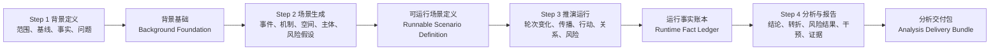
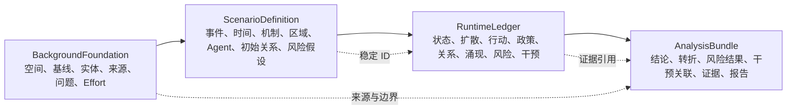

# Kaleido Step 1-4 信息架构 V2 方案

## 1. 方案目的

本方案将 Kaleido 四步流程从“按技术产物和数据类型分栏”调整为“按用户在每一步必须回答的问题组织”。

目标不是推翻现有地图、图谱、Agent、风险对象和报告能力，而是重新定义这些能力在四个步骤中的职责、展示层级和数据合同，使同一业务对象只在最合适的步骤承担一个明确任务。

四步只回答四个核心问题：

1. `背景定义`：我们正在研究什么现实系统？
2. `场景生成`：准备让这个系统经历什么？
3. `推演运行`：系统正在发生什么变化？
4. `分析与报告`：这些变化意味着什么，下一步应该做什么？

## 2. 总体信息架构

### 2.1 四步职责边界

| 步骤 | 用户任务 | 允许编辑 | 主要观察 | 核心产物 | 不在本步承担 |
| --- | --- | --- | --- | --- | --- |
| Step 1 | 定义现实背景和研究边界 | 空间范围、基线、事实、研究问题、分析强度 | 地图证据、已识别实体、资料来源 | 背景基础 | 灾害事件编排、政策方案、Agent 配置 |
| Step 2 | 生成并确认可运行场景 | 事件、政策、必要的时间纠正 | 机制、时间、区域、Agent、初始关系、风险假设 | 可运行场景定义 | 运行态变化、动态关系、最终结论 |
| Step 3 | 观察运行并进行可选干预 | 运行时干预 | 轮次变化、传播、Agent 行动、关系变化、风险变化 | 运行事实账本 | 完整报告、反事实效果宣称 |
| Step 4 | 解释结果并形成交付 | 分析问题、报告范围、交付格式 | 结论、关键转折、风险结果、干预关联、证据边界 | 分析交付包 | 再次完整播放运行过程、修改已发生事实 |

## 3. 页面级信息架构图

```mermaid
flowchart TB
  ROOT["Kaleido 四步工作流"]

  ROOT --> STEP1["Step 1 背景定义"]
  STEP1 --> S1A["空间范围"]
  STEP1 --> S1B["系统基线"]
  STEP1 --> S1C["事实与资料"]
  STEP1 --> S1D["研究问题与边界"]
  STEP1 --> S1E["背景基础审阅"]

  ROOT --> STEP2["Step 2 场景生成"]
  STEP2 --> S2A["演化计划"]
  STEP2 --> S2B["机制模型"]
  STEP2 --> S2C["空间结构"]
  STEP2 --> S2D["主体系统"]
  STEP2 --> S2E["风险假设"]
  STEP2 --> S2F["运行准备检查"]

  ROOT --> STEP3["Step 3 推演运行"]
  STEP3 --> S3A["本轮演化"]
  STEP3 --> S3B["空间状态"]
  STEP3 --> S3C["传播机制"]
  STEP3 --> S3D["主体响应"]
  STEP3 --> S3E["风险对象"]
  STEP3 --> S3F["运行干预抽屉"]

  ROOT --> STEP4["Step 4 分析与报告"]
  STEP4 --> S4A["结论与建议"]
  STEP4 --> S4B["关键转折"]
  STEP4 --> S4C["风险结果"]
  STEP4 --> S4D["干预评估"]
  STEP4 --> S4E["证据与边界"]
  STEP4 --> S4F["报告交付模式"]
```

## 4. Step 1 背景定义

### 4.1 页面目标

Step 1 只负责建立一个可验证的现实背景，不提前设计推演事件和政策。

页面不设置顶层页签，采用“输入态 -> 生成态 -> 审阅态”三态切换。左侧始终是现实地图和证据锚点，右侧是当前任务。

### 4.2 输入态

#### A. 空间范围

- 地点或区域名称。
- 地图选点。
- 当前支持中心点和分析半径。
- 页面明确说明这是“搜索范围”，并显示用户真正关注的中心锚点。
- 后续能力可以扩展行政区、多边形和多区域，但不在本轮重构中虚构支持。

#### B. 系统基线

- 当前常态结构。
- 生态和社会基线。
- 日常活动节奏。
- 已知约束。

原来的“稳态描述”保留，但名称改为“当前系统基线”。

#### C. 事实与资料

- 上传 PDF、Markdown、TXT。
- 已知主体、设施和环境对象作为可选纠正项。
- 展示已读取资料清单和可用来源，不展示内部解析过程。

#### D. 研究问题与边界

- 主要研究问题。
- 关注关系或对象。
- 空间、时间和内容排除项。
- 分析强度及其业务含义。

“补充背景与关注点”和“进入推演的默认目标”合并到这一组。

#### E. 从 Step 1 移出的内容

- `推演变量`移到 Step 2 的“演化计划”。
- 灾害事件和政策措施不在 Step 1 编辑。
- 不再把“背景报告写得是否完整”作为进入 Step 2 的主判断。

### 4.3 审阅态

生成后直接展示结构化“背景基础”，而不是先展示长篇 Markdown：

1. 空间边界和真实锚点。
2. 基线状态。
3. 已识别主体、设施和环境受体。
4. 资料与证据来源。
5. 研究问题和排除范围。
6. 待确认的数据缺口。
7. 已锁定的 Effort 快照。

底部动作：

- `返回修改`
- `进入场景生成`

背景文字报告降为“查看背景详情”，不再占据主要工作面，也不提供类似 Step 4 的报告编辑体验。

### 4.4 Step 1 图谱语义

左侧只展示现实世界证据：

- 用户选定范围。
- 地图真实节点。
- 来源明确的环境、设施和行政对象。
- 推断代理节点只能标记为背景代理线索，不能显示为正式 Agent。

## 5. Step 2 场景生成

### 5.1 页面目标

Step 2 负责把背景基础转化为一个可以运行、可以解释、可以检查缺口的场景定义。

页面仍保留三个互斥状态：

1. 配置输入。
2. 系统生成。
3. 审阅结果。

### 5.2 配置输入

主输入只包括：

- 一个或多个事件，支持顺序和并发。
- 可选政策措施。
- 系统自动时间计划的必要人工纠正。

不重新询问 Step 1 已锁定的范围、背景、资料和分析强度。

### 5.3 审阅结果页签

#### 页签 1：演化计划

回答：事情按什么顺序、用多长时间发生？

展示：

- 事件序列和并发分支。
- 每个事件的目标区域和目标对象。
- 开始轮次、持续轮次、延迟和总覆盖时间。
- 政策计划的预定作用窗口。
- 自动计划与人工纠正的差异。

#### 页签 2：机制模型

回答：系统准备按什么因果逻辑演化？

展示：

- 场景状态变量和方向。
- 完整机制节点与机制边。
- 作用通道、延迟、范围和依据。
- 机制路径中的断点、未解析对象和待确认假设。
- 点击机制边后同步高亮左侧图谱。

不能只展示“7 个节点、6 条边”的统计数字。

#### 页签 3：空间结构

回答：哪些区域进入推演，它们如何相邻和分层？

展示：

- 区域和子区域。
- 层级、邻接、空间锚点。
- Agent 覆盖情况。
- 没有 Agent 或没有机制进入的空间缺口。

#### 页签 4：主体系统

回答：谁参与、能做什么、通过什么初始关系协作？

展示：

- Agent 对比表和选中详情。
- 角色需求覆盖。
- 能力、权限、资源和行动边界。
- 政策执行主体绑定。
- 初始 Agent 关系骨架。
- 未覆盖角色需求及其业务影响。

Step 2 只展示初始关系。运行中增强、削弱、新建和中断的关系属于 Step 3。

#### 页签 5：风险假设

回答：本次推演准备观察哪些风险假设？

展示：

- 风险对象选择器和选中详情。
- 完整机制路径。
- 受影响主体和区域。
- 证据与认识状态。
- 专属监测指标和转折条件。
- 与 Step 3 风险运行态的稳定 ID 对应关系。

风险分数只有在具有明确量纲或校准解释时显示。没有校准时使用“证据较弱、一般、较强”等业务状态和来源数量，避免把 49、61 之类数值误读成概率。

### 5.4 运行准备检查

运行准备检查固定在底部操作区上方，不另设页签。检查项包括：

- 事件目标是否解析。
- 时间计划是否覆盖全部事件。
- 机制图是否存在断边。
- 区域引用是否有效。
- 角色需求是否覆盖。
- 政策是否绑定执行主体。
- 风险是否存在悬空引用。

每个缺口必须给出业务影响和下一步动作。内部 Fallback、模型路由和异常细节只进入诊断面。

### 5.5 Step 2 图谱语义

图谱层级必须显式区分：

- 空间骨架。
- 机制因果边。
- Agent 初始关系。
- 风险机制路径。

右侧数量和左侧边数使用相同名称，不能把 4 条 Agent 关系和 131 条全图关系都简称为“关系”。

## 6. Step 3 推演运行

### 6.1 持久运行层

顶部固定展示：

- 当前轮次和总轮次，例如 `R7 / 12`。
- 模拟时间和每轮步长。
- 播放、暂停。
- `跟随推演`或`固定在 R7`。

打开详情时默认固定当前界面轮次，但不停止后台运行。

### 6.2 五个观察页签

#### 页签 1：本轮演化

展示本轮 3-5 个最重要变化，按真实运行顺序组织：

`状态和扩散 -> Agent 行动 -> 关系或政策作用 -> 反馈 -> 风险变化`

每条变化包含前值、后值、位置、主体、原因工件和图谱定位。

#### 页签 2：空间状态

展示区域相对上一轮和基线的变化，使用动态 ScenarioStateSchema，不写死固定指标。

#### 页签 3：传播机制

展示已生效和待生效的扩散转移，以及真正检测到的强化型或平衡型反馈闭环。

#### 页签 4：主体响应

内部分为：

- Agent。
- 行动与政策。
- 关系演化。
- 角色涌现。

展示候选行动、选中行动、拒绝原因、资源变化、状态变更、政策执行条件、关系指标变化和 Agent 谱系。

#### 页签 5：风险对象

展示风险状态、张力变化、趋势、生命周期、证据变化和主要风险切换。

### 6.3 长机制链规则

- 4-6 步：桌面横向完整展示。
- 7-10 步：横向概览，支持折叠和展开。
- 超过 10 步：主链加分支，默认只展示关键路径。
- 窄屏切换为纵向。
- Step 2 和 Step 3 使用同一个共享组件和相同因果方向。

### 6.4 Step 3 图谱语义

| 页签 | 左侧图谱模式 |
| --- | --- |
| 本轮演化 | 本轮发生变化的节点和边 |
| 空间状态 | 区域状态热力和增量 |
| 传播机制 | 扩散路径和反馈闭环 |
| 主体响应 | Agent、行动、政策和动态关系 |
| 风险对象 | 风险机制路径、作用区域和受影响主体 |

## 7. Step 4 分析与报告

### 7.1 页面目标

Step 4 不重新完整播放 Step 3，而是把运行事实压缩成可辩护的结论、风险结果、干预判断和证据边界。

### 7.2 五个分析页签

#### 页签 1：结论与建议

展示：

- 3-5 条关键发现。
- 最重要的风险结果。
- 最受影响的区域和主体。
- 可执行建议。
- 每条结论的证据状态和适用边界。

不以单个最高分区域代替完整结论。

#### 页签 2：关键转折

展示真正改变系统方向的若干因果片段，而不是每一轮的卡片列表：

`触发 -> Agent 行动 -> 传播或关系变化 -> 风险结果`

支持按转折点定位左侧结果图谱和相关轮次。

#### 页签 3：风险结果

把 Step 2 风险假设与 Step 3 运行结果逐一对照：

- 已出现。
- 持续增强。
- 得到缓解。
- 未被验证。
- 已关闭。
- 运行中新出现。

展示主要证据、作用范围、张力轨迹和结论边界。

#### 页签 4：干预评估

展示：

- 政策和用户干预是否实际执行。
- 执行前后状态。
- 受益对象和代价对象。
- 阻断条件和执行摩擦。
- 与后续变化的时间和机制关联。

只有存在对照分支或反事实运行时才能表述为“效果”。没有对照时统一表述为“观测到的关联”，不能宣称因果效果。

#### 页签 5：证据与边界

提供独立的证据索引，而不是要求用户必须先点击图谱节点。

可按以下对象进入：

- 结论。
- 风险对象。
- 区域。
- Agent。
- 行动或政策。
- 关系。
- 轮次事件。

统一标识：

- 观测。
- 推断。
- 假设。
- 缺失数据。
- 模型边界。

### 7.3 正式报告的定位

正式报告从顶层分析页签移出，成为固定交付动作：

- `打开报告`
- `导出 PDF`
- `导出 Markdown`
- `打印`

打开后进入报告阅读模式，包含：

- 执行摘要。
- 目录。
- 章节导航。
- 结论到证据的引用跳转。
- 观测、推断和假设标识。
- 报告版本和生成时间。
- 返回分析工作台。

## 8. 数据合同

### 8.1 BackgroundFoundation

至少包含：

- `foundation_id`
- `contract_version`
- `area_of_interest`
- `spatial_anchors`
- `baseline_state`
- `known_entities`
- `source_refs`
- `research_questions`
- `analysis_boundaries`
- `open_data_gaps`
- `effort_snapshot_ref`

### 8.2 ScenarioDefinition

至少包含：

- `scenario_definition_id`
- `contract_version`
- `foundation_ref`
- `event_plan`
- `temporal_plan`
- `scenario_state_schema`
- `mechanism_graph`
- `regions`
- `agent_profiles`
- `initial_relationships`
- `policy_plans`
- `risk_definitions`
- `readiness_checks`

### 8.3 RuntimeLedger

至少统一引用：

- `round_snapshots`
- `spread_event_ledger`
- `agent_action_decision_ledger`
- `state_mutation_ledger`
- `policy_execution_ledger`
- `relationship_event_ledger`
- `relationship_state_ledger`
- `agent_emergence_ledger`
- `agent_lineage_ledger`
- `risk_runtime_state`
- `risk_events`
- `intervention_ledger`
- `detected_feedback_loops`

### 8.4 AnalysisBundle

必须由 RuntimeLedger 投影，不再只依赖旧机制图和轮次摘要：

- `executive_findings`
- `turning_points`
- `risk_outcomes`
- `intervention_observations`
- `impact_scope`
- `evidence_index`
- `uncertainty_boundaries`
- `report_artifact_ref`

## 9. 全局交互规则

### 9.1 图谱与工作台联动

- 右侧选择必须改变左侧图谱的高亮模式。
- 左侧选择必须在右侧打开对应业务对象。
- 每个步骤都明确说明左侧图谱当前表达的是现实证据、场景定义、运行变化还是结果证据。

### 9.2 空状态

- 没有对象时不渲染巨型零值模块。
- 显示一句业务解释和一个下一步动作。
- 合法的零风险场景、零政策场景和零动态关系场景仍可继续流程。

### 9.3 大规模数据

- Agent 超过 20 个时使用对比表、筛选和选中详情，不使用卡片墙。
- 区域超过 12 个时使用排序表和图谱联动，不平铺全部卡片。
- 关系记录按对象聚合，默认展示当前状态，历史按需展开。
- 轮次超过 20 时以关键转折和阶段摘要为主，不逐轮平铺。

### 9.4 运行状态与业务结果

- 正常完成由结果替换过程状态，不额外显示成功 Toast 或横幅。
- 系统日志、模型路由、Fallback、异常栈和内部置信度留在诊断面。
- 业务页面只展示经验证的结果、缺口和下一步动作。

## 10. 路由与壳层收敛

### 10.1 目标

- Step 1-4 全部使用 `KaleidoWorkflowShell`。
- Step 2 只保留一个父级页面入口，合并 `MainView.vue` 和 `SimulationView.vue` 的壳层职责。
- 新建场景和已保存场景只在数据加载阶段不同，页面结构、图谱投影和行为完全一致。
- 桌面端保持左侧视觉区、右侧工作台和固定底部操作区。
- 移动端在“图谱”和“工作台”之间切换，不压缩成窄双栏。

### 10.2 兼容规则

- 保留现有 `/simulation/:simulationId`、`/simulation/:simulationId/start` 和 `/analysis/:reportId` 外部路由语义。
- 历史 Step 4 查询参数继续映射到新的目标页签。
- 武汉 V1 冻结数据只做兼容性验收，不用它定义 V2 页面能力。

## 11. 实施阶段

### Phase 0：合同冻结与验收基线

- 确认本方案的四步职责和页签名称。
- 建立 BackgroundFoundation、ScenarioDefinition、RuntimeLedger、AnalysisBundle 的版本化 DTO。
- 建立一条完整 V2 验收场景，必须包含行动、政策、关系变化、Agent 涌现、风险变化和 Step 4 报告。
- 保留武汉 V1 兼容夹具。

### Phase 1：共享壳层和路由

- Step 1 接入共享壳层。
- 合并 Step 2 双入口职责。
- 统一滚动容器、底部操作区、页签和图谱高亮接口。

### Phase 2：Step 1

- 合并重叠输入。
- 将事件和政策编辑移到 Step 2。
- 建立结构化背景基础审阅页。
- 背景 Markdown 降为详情。

### Phase 3：Step 2

- 重组五个审阅页签。
- 补完整事件时间线和机制模型视图。
- 合并 Agent 与初始关系。
- 建立运行准备检查。
- 统一长机制链组件。

### Phase 4：Step 3

- 重组五个运行观察页签。
- 接入真实反馈闭环和显式行动账本。
- 将动态关系和 Agent 涌现移入主体响应。
- 增加跟随推演和固定轮次。

### Phase 5：Step 4

- ReportAnalysisService 接入全部 V2 RuntimeLedger。
- 建立结论、转折、风险结果、干预评估和证据索引。
- 把完整播放降为证据定位能力。
- 将正式报告改为交付模式，并补目录、引用和导出。

### Phase 6：全流程验收

- Step 1 到 Step 4 新建正式场景。
- 刷新和返回后恢复最后有效工件。
- 验证 0 风险、0 政策、0 动态关系。
- 验证 10 步以上机制链。
- 验证 200 个以上 Agent。
- 验证 100 轮推演。
- 验证正式 V2 报告和武汉 V1 兼容。
- 执行前端类型检查、构建、后端聚焦测试和浏览器级验收。

## 12. 本轮明确不包含

- 不新增用户可见的模型选择、架构选择或模板选择。
- 不在没有对照分支时虚构反事实效果。
- 不改变风险对象必须由机制路径和证据锚定的规则。
- 不改变 Step 3 运行时只演化既有正式 Agent 集合的基本边界；运行时 Agent 涌现继续遵守 V2 规则。
- 不为武汉 Demo 单独实现页面逻辑。

## 13. 关键产品决策

本方案采用以下默认决策：

1. Step 1 不再承担事件和政策设计。
2. Step 2 的初始关系并入“主体系统”，不单独占一个顶层页签。
3. Step 3 动态关系并入“主体响应”，风险对象独立。
4. Step 4 不再完整复制 Step 3 播放。
5. 正式报告从分析页签提升为独立交付模式。
6. 四步共享稳定 ID、证据引用和同一套图谱联动接口。

## 14. 2026-07-14 实施进度

已完成：

- 建立 `background-foundation.v2`、`scenario-definition.v2`、`runtime-ledger.v2`、`analysis-bundle.v2` 投影服务；复用原文件和账本，不新增用户可见架构概念。
- 新生成配置持久化 `scenario_definition.json`，历史配置读取时动态补齐同一投影。
- Step 2 增加六类运行准备检查、阻断/警告分级和页签定位动作；零风险、零政策保持合法。
- Step 4 `风险结果` 改为风险假设、运行状态和风险事件的稳定 ID 对照，并覆盖运行中新风险和未被验证状态。
- Runtime artifact API 增加统一 `runtime_ledger` 投影。
- 增加后端合同/风险结果测试和前端信息架构回归。
- Step 1 已直接接入 `KaleidoWorkflowShell`，地图和背景定义分别成为统一视觉区与工作台，不再维护独立顶栏和 viewport 布局。
- `/process/:projectId` 已收敛为模拟入口解析/创建的过渡路由，取得 `simulation_id` 后立即替换到唯一正式 Step 2 工作区 `/simulation/:simulationId`；Step 2 返回动作统一回到 Step 1，不再在两个 Step 2 父页面之间循环。
- Step 4 `结论与建议`、`关键转折`、`证据与边界` 已直接消费 `analysis-bundle.v2`；风险、干预、影响范围、证据和不确定性由同一投影连接，动态关系不再升级为独立顶层模块。
- 武汉 V1 已完成浏览器兼容复核：Step 1 共享壳层、Step 2 过渡路由、Step 4 结论/转折/证据视图均可读取真实历史产物。
- 已建立正式 V2 跨步骤验收夹具，覆盖零风险、12 节点/11 边机制链、240 个 Agent、239 条初始关系、100 轮运行账本、分析证据与报告交付引用，确认四类版本化投影不按页面规模截断。
- 正式报告阅读面已补充 Markdown 下载和浏览器打印/PDF 动作，只有存在有效正文时才显示交付按钮。

后续扩展性验收（不阻断本轮信息架构 V2 收口）：

- 在引入新的正式黄金场景或修改生成合同后，补一轮真实生成式 Step 1→4 全流程运行；当前确定性验收夹具与武汉 V1 兼容夹具继续作为快速回归基线。
