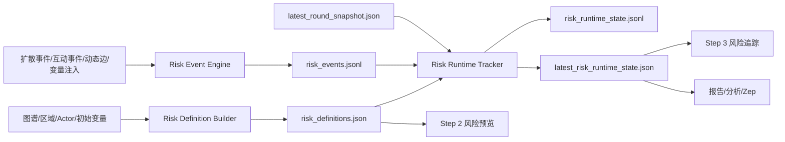
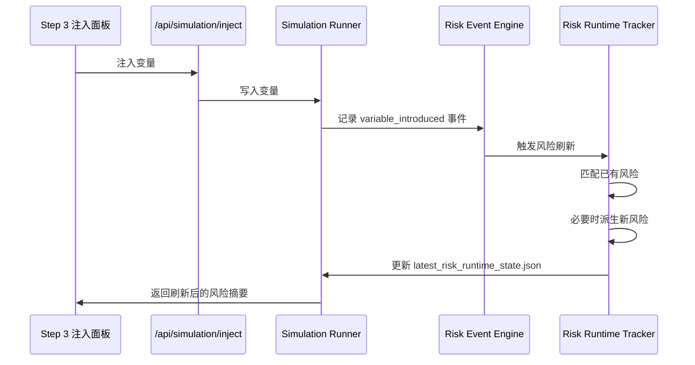

# EnvFish 风险模块重构设计

## 1. 文档目标

本文档用于完成 EnvFish 风险模块的整体设计，明确：

1. 风险模块在当前系统中的真实位置
2. 风险模块后续应承担的职责边界
3. Step 2 / Step 3 的功能分工
4. 风险如何与中途变量、推演运行态、报告与分析联动
5. 数据模型、文件工件、API、迁移顺序与兼容策略

本文档默认以当前代码实现为约束基础，优先做增量演进，不推翻现有入口和工作流。

## 2. 现状诊断

### 2.1 当前实现的真实形态

当前风险模块并不是“运行中的风险链引擎”，而是“准备阶段生成的一组风险对象工件”。

- `prepare` 阶段由 `RiskObjectBuilder` 生成 `risk_objects.json` 与 `risk_object_summary.json`
- `simulation_config.json` 也会内嵌一份 `risk_objects`
- Step 2 和 Step 3 前端主要展示这份静态结果
- 运行期只把 `risk_objects` 弱耦合地接入跨区候选关系搜索
- 报告、分析图和 Zep 上下文会继续消费这份工件

现有关键接点：

- 生成入口：
  - [backend/app/services/simulation_manager.py](../backend/app/services/simulation_manager.py)
- 风险对象构建：
  - [backend/app/services/risk_object_builder.py](../backend/app/services/risk_object_builder.py)
- 运行时读取：
  - [backend/scripts/run_envfish_simulation.py](../backend/scripts/run_envfish_simulation.py)
- Step 2 展示：
  - [frontend/src/components/EnvFishStep2.vue](../frontend/src/components/EnvFishStep2.vue)
- Step 3 展示：
  - [frontend/src/components/EnvFishStep3.vue](../frontend/src/components/EnvFishStep3.vue)
- 报告与分析：
  - [backend/app/services/report_analysis.py](../backend/app/services/report_analysis.py)
  - [backend/app/services/zep_tools.py](../backend/app/services/zep_tools.py)

### 2.2 当前问题

当前设计存在五个核心问题：

1. 风险对象是静态工件，但在 Step 3 中被感知为运行态链路。
2. 风险定义过于模板化，容易宽泛、重复、同质化。
3. 风险对象和中途变量的联动不足，变量注入后不会自动刷新风险定义或风险状态。
4. 风险高亮是“节点聚焦”，不是“链路追踪”。
5. 风险对象虽然进入了报告和分析，但作为解释层有价值，作为运行层还不够强。

### 2.3 当前设计仍然有价值的部分

当前风险模块并非无用，以下部分应保留：

- 把复杂场景压缩成若干可解释“风险对象”的产品思路
- `why_now / chain_steps / affected_clusters / scenario_branches` 这些解释字段
- 把风险对象映射回图谱节点、区域、agent 的展示方式
- 运行期将 `shared_risk_object` 作为动态长边候选优先级信号
- 报告和分析图中把风险对象作为独立解释节点

结论：

- 当前风险模块不是底层仿真核心
- 但它非常适合升级为“风险视角层”的核心入口

### 2.4 当前迁移约束

当前代码存在几个必须正视的迁移约束：

1. `static-at-prepare` 假设已经渗透全栈。
   - 当前系统默认风险对象只在 prepare 时生成一次
   - simulation API、run detail、report analysis、zep tools 都在读取落盘的静态工件

2. `risk_objects.json / risk_object_summary.json` 是强兼容工件。
   - 多个消费者都直接依赖这两个文件
   - 第一阶段不能直接删除或重命名

3. 当前 runner 会从 `simulation_config.json` 直接读取 `risk_objects`。
   - 如果新模型完全脱离 config 而不保留兼容投影，运行期会断

4. 目前 `region_scope / primary_regions` 主要用显示名称，不一定是稳定 `region_id`。
   - 这在 `region_id == name` 的场景里不会暴露问题
   - 一旦 region id 与显示名称分离，就会导致 risk-route 匹配脆弱

5. 现有风险定义是模板驱动，不是深度发现。
   - 当前 `risk_objects` 更像“风险专题包”
   - 不应把它们误判成已经足够精细的运行态因果链

## 3. 目标定位

### 3.1 产品定位

风险模块后续应定位为：

- `场景框定器`
- `运行追踪器`
- `解释与归因层`

不建议把风险模块做成底层主仿真器。

底层核心仍然应该是：

- 区域扩散
- agent 互动
- 动态边生成
- 状态聚合

风险模块负责：

- 用户当前应该盯什么风险
- 风险从哪里开始，沿什么路径传播
- 哪些人和区域先受损
- 哪些干预分支值得测试
- 当前轮次为什么升高或缓解

### 3.2 设计原则

1. 用户入口不新增概念爆炸。
   - 前台继续使用“风险对象 / 风险链路”语言
   - `risk_definition / risk_runtime_state / risk_event` 仅为内部模型

2. Step 2 与 Step 3 职责拆开。
   - Step 2 负责定义和校准
   - Step 3 负责追踪和比较

3. 风险必须与变量联动。
   - 中途变量注入后，风险必须刷新
   - 关键变量允许创建新风险链路

4. 风险必须有路径，不只是主题。
   - 不是“市场风险”这种标题即可
   - 必须能回答“从哪来、怎么传、谁受损、什么时候跨阈值”

5. 允许更多风险，但默认聚焦少量风险。
   - 系统可保存全量风险
   - UI 默认钉住少量最重要风险

## 4. 目标架构

风险模块重构后建议拆成三层：



### 4.1 内部模型分层

#### A. Risk Definition

表示风险的静态定义与追踪框架。

职责：

- 定义风险主题和路径模板
- 记录作用域、相关区域、相关实体、相关群簇
- 定义监测指标与触发规则
- 定义可比较的干预和分支模板

生成时机：

- Step 2 prepare 完成时
- 中途变量注入后若触发“重新框定风险”
- 用户手动请求重新框定时

#### B. Risk Runtime State

表示某个风险在某轮或某时刻的实际运行态。

职责：

- 表示风险当前严重度
- 表示风险趋势和活跃链路步骤
- 挂接受影响区域、agent、动态边和证据
- 输出当前轮次的解释信息

生成时机：

- 每轮结束时刷新
- 变量注入后立即刷新一次
- 手动重算时刷新

#### C. Risk Events

表示会改变风险状态或创建新风险的事件流。

职责：

- 记录变量注入触发
- 记录阈值跨越
- 记录链路步骤激活
- 记录新风险创建、升级、降温、合并、关闭

生成时机：

- 变量注入
- 每轮快照完成
- 运行时显著事件发生时

## 5. 风险类型设计

### 5.1 风险分类

建议将风险分为三类：

1. `baseline`
   - 场景初始存在的结构性风险
   - 例如生态脆弱、市场信任脆弱、治理响应摩擦

2. `variable_triggered`
   - 由新增变量直接触发的风险
   - 例如新污染源、强制搬迁、信息披露政策导致的新链路

3. `emergent`
   - 运行过程中由扩散、互动、动态边、反馈链共同涌现的新风险
   - 例如原本局部风险演化成跨区供应替代风险

### 5.2 风险不是“标题”，而是“路径”

一个有效风险至少要包含：

- `trigger`：什么触发它
- `source`：风险从哪里起
- `path`：沿什么路径传播
- `first_order_impact`：第一批直接受损对象
- `second_order_impact`：第二批次生影响对象
- `metrics`：哪些状态指标用于判断风险强度
- `turning_conditions`：什么条件下跨过关键阈值
- `candidate_interventions`：哪些干预可以改变它

示例：

- `近岸污染 -> 生态受体受损 -> 渔民收入下滑 -> 批发收缩 -> 消费信任下降`
- `披露迟滞 -> 居民恐慌上升 -> 游客撤离 -> 社区收入受损 -> 政府响应压力上升`

## 6. 目标数据模型

### 6.1 RiskDefinition

```json
{
  "risk_id": "risk_nearshore_eco_livelihood_chain",
  "legacy_risk_object_id": "risk_eco_social_cascade",
  "category": "baseline",
  "risk_type": "eco_social_cascade",
  "title": "近岸海域生态-生计级联风险",
  "summary": "围绕近岸污染、生态受体、渔业收入与消费信任的链路。",
  "status": "tracked",
  "priority_seed": 0.78,
  "scope": {
    "regions": [
      {"region_id": "nearshore", "region_name": "近岸海域"},
      {"region_id": "port_market", "region_name": "渔港与水产交易市场"}
    ],
    "entities": [
      {"entity_uuid": "uuid_a", "entity_name": "贝类养殖区"}
    ],
    "actors": [
      {"actor_id": 21, "actor_name": "渔民群体_21"}
    ]
  },
  "chain_template": [
    {
      "step_id": "source_pressure",
      "label": "环境压力上升",
      "step_type": "source_hazard",
      "monitor_metrics": ["exposure_score", "spread_pressure"]
    },
    {
      "step_id": "eco_damage",
      "label": "生态受体受损",
      "step_type": "ecological_damage",
      "monitor_metrics": ["ecosystem_integrity", "vulnerability_score"]
    },
    {
      "step_id": "livelihood_loss",
      "label": "生计稳定性下降",
      "step_type": "livelihood_loss",
      "monitor_metrics": ["livelihood_stability", "economic_stress"]
    }
  ],
  "affected_clusters": [],
  "intervention_templates": [],
  "branch_templates": [],
  "trigger_rules": {
    "variable_types": ["disaster", "policy"],
    "policy_modes": ["monitor", "disclose", "restrict"],
    "min_intensity": 40
  },
  "evidence_refs": [],
  "created_at": "2026-04-02T10:00:00"
}
```

关键要求：

- 作用域必须同时保存稳定 ID 和显示名称
- 不能只存 `region_name`
- `legacy_risk_object_id` 用于兼容旧前端和旧报告流程

### 6.2 RiskRuntimeState

```json
{
  "risk_id": "risk_nearshore_eco_livelihood_chain",
  "round": 6,
  "severity_score": 78.2,
  "confidence_score": 0.73,
  "trend": "rising",
  "runtime_priority": 0.84,
  "active_step_ids": ["source_pressure", "eco_damage"],
  "step_states": [
    {
      "step_id": "source_pressure",
      "label": "环境压力上升",
      "status": "active",
      "score": 0.91,
      "evidence_refs": ["spread_event:13", "variable:disaster_2"]
    },
    {
      "step_id": "eco_damage",
      "label": "生态受体受损",
      "status": "active",
      "score": 0.76,
      "evidence_refs": ["feedback:eco_impact:6"]
    }
  ],
  "impacted_regions": [
    {"region_id": "nearshore", "region_name": "近岸海域"}
  ],
  "impacted_actors": [
    {"actor_id": 21, "actor_name": "渔民群体_21"}
  ],
  "related_dynamic_edge_ids": ["dynamic::21::3::market_link"],
  "drivers": [
    "灾难变量 nuclear_discharge 已进入场景",
    "shared_risk_object 触发跨区候选关系"
  ],
  "buffers": ["社区卫生系统披露行动"],
  "turning_points": ["海产品消费信心跌破预警阈值"],
  "explanation": "污染扩散与消费转移共同推动该风险进入上升阶段。",
  "updated_at": "2026-04-02T11:00:00"
}
```

### 6.3 RiskEvent

```json
{
  "event_id": "risk_event_0001",
  "round": 6,
  "event_type": "variable_introduced",
  "risk_id": "risk_nearshore_eco_livelihood_chain",
  "source_ref": "variable:disaster_2",
  "summary": "新灾难变量进入场景，触发该风险刷新。",
  "delta": {
    "severity_score": 12.0
  },
  "evidence_refs": ["variable:disaster_2"],
  "timestamp": "2026-04-02T11:00:00"
}
```

事件类型建议：

- `created`
- `reframed`
- `variable_introduced`
- `step_activated`
- `escalated`
- `cooled`
- `resolved`
- `merged`

## 7. Step 2 / Step 3 功能分工

### 7.1 Step 2：风险定义与场景校准

Step 2 只处理 `RiskDefinition`。

用户目标：

- 看当前场景有哪些基线风险
- 看主风险和次风险
- 看风险覆盖了哪些区域、节点、群簇
- 看每条风险的大致路径和候选干预
- 决定哪些风险要被持续追踪

建议保留现有页面入口，不新增新一级页面，仅重组当前风险面板内容：

1. `风险概览`
   - 风险卡片列表
   - 主风险标记
   - priority seed / mode / why now

2. `链路模板`
   - 展示 chain template
   - 展示每个 step 对应监测指标

3. `受影响群簇`
   - 展示 affected clusters
   - 展示该风险会优先伤害谁

4. `分支模板`
   - 展示候选 intervention templates 和 branch templates
   - 只做定义，不执行

建议支持的用户动作：

- 选择主风险
- pin / unpin 风险
- 启用 / 禁用某个风险追踪
- 手动重新框定风险集

Step 2 不建议做的事：

- 不直接编辑每轮风险分数
- 不把 Step 2 做成运行期 dashboard
- 不在此处展示每轮波动时间线

### 7.2 Step 3：风险运行追踪与干预比较

Step 3 只处理 `RiskRuntimeState`。

建议把风险区分成三层：

- `Pinned Risks`
  - 默认展示 3 个
  - 来源是运行态优先级排序 + 用户 pin
- `Active Risks`
  - 当前严重度或趋势显著的风险
- `All Risks`
  - 全量定义中的风险

说明：

- “默认展示 3 个”只是 UI 聚焦数，不是系统总风险数上限
- 系统可以维护 8 到 12 个定义中的风险
- Step 3 默认只盯最重要的少量风险，避免界面退化成风险数据库

Step 3 建议展示：

1. `当前严重度`
2. `趋势`
3. `本轮已激活的链路步骤`
4. `当前受影响区域和 actor`
5. `关联动态边`
6. `本轮驱动因素 / 缓冲因素`
7. `触发该轮变化的变量或事件`
8. `当前建议优先干预`

Step 3 的“分支比较”建议升级为可执行功能：

- 不是只显示 `branch.name + description`
- 应支持从 branch template 直接生成注入预设
- 用户点击某个 branch，可快速装配一组变量/政策注入

## 8. 变量注入与风险刷新

### 8.1 设计原则

关键变量注入后，风险必须刷新。

不是：

- 变量只更新状态分数
- 风险对象保持不变

而是：

- 变量进入场景后立即产生 `risk_event`
- 触发风险刷新
- 需要时创建新风险或派生风险

### 8.2 刷新流程



### 8.3 注入后的行为规则

#### Disaster 变量

默认行为：

- 一定触发风险刷新
- 当变量覆盖新区域、新受损对象或新路径时，允许创建 `variable_triggered` 风险

#### Policy 变量

默认行为：

- 一定触发风险刷新
- 优先更新已有风险 runtime state
- 如果政策引入新的摩擦链、补偿链、转移链，也允许派生新风险

### 8.4 新风险创建规则

建议同时满足以下条件之一时创建新风险：

1. 变量目标区域与现有定义重叠不足
2. 变量引入新的路径类型
3. 变量作用的首批受损群体与现有风险明显不同
4. 变量导致新的治理或市场机制成为主路径

派生新风险前必须进行去重：

- 与现有定义相似度高于阈值时，优先更新旧风险
- 每轮新创建风险数设硬上限，建议 `<= 2`
- 全量风险定义数建议设软上限，建议 `<= 12`

### 8.5 手动重新框定

除自动刷新外，保留手动动作：

- `重新框定风险集`

适用场景：

- 连续多次变量注入后
- 用户明确认为当前风险集合过旧
- 进入新的场景阶段

手动重新框定的目标是更新 `RiskDefinition`，不是只刷新 `RiskRuntimeState`。

## 9. 风险如何影响整体推演

### 9.1 保留弱耦合，不接管底层引擎

风险模块不应直接成为底层状态更新器。

风险模块影响推演的方式建议限定为以下五类：

1. `动态边候选优先级`
   - 保留当前 `shared_risk_object` 思路
   - 但改为基于 `risk_definition.scope + runtime severity`

2. `agent 监测与响应优先级`
   - 活跃风险越高，相关治理/组织 agent 越容易被激活

3. `报告焦点`
   - 主报告优先围绕 active risks 展开

4. `分析图高亮与归因`
   - 风险节点、风险路径、关联动态边和证据一并展示

5. `干预推荐`
   - Step 3 注入面板优先显示命中当前 active risks 的预设

### 9.2 不建议让风险模块直接做的事

- 不直接决定区域扩散公式
- 不直接替代 agent 行动选择器
- 不直接作为唯一状态源

原因：

- 会把解释层和仿真层绑死
- 后续很难演进

## 10. 前端交互设计

### 10.1 Step 2 风险区块

建议保留现有“风险对象预览”区域，但重命名为：

- 标题：`风险对象预览`
- 副标题：`Step 2 定义层`

展示内容：

- 风险卡
- 链路模板 step pills
- 相关实体节点
- 相关区域
- 受影响群簇
- 候选分支

图谱高亮建议升级为：

- 继续高亮风险相关节点
- 新增对“定义层路径边”的高亮
- 若没有边，只退化为节点高亮

### 10.2 Step 3 风险区块

建议保留现有“风险对象链路”工作区，但内部改成：

1. `Pinned Risks`
2. `Active Risks`
3. `Risk Timeline`
4. `Active Steps`
5. `Linked Edges`
6. `Triggered By`
7. `Suggested Interventions`

当前 Step 3 的风险面板仍然更像静态对象详情页，后续应升级为运行追踪页。

### 10.3 图谱联动

当前图谱高亮主要依赖节点 ID 和节点名称，不区分路径边。

后续建议高亮 payload 升级为：

```json
{
  "label": "近岸海域生态-生计级联风险",
  "riskId": "risk_xxx",
  "nodeIds": ["agent::21", "risk::risk_xxx"],
  "nodeNames": ["近岸海域", "渔民群体_21"],
  "edgeIds": ["edge::risk-region::...", "edge::dynamic::..."],
  "mode": "risk_runtime"
}
```

GraphPanel 建议支持：

- `highlightEdgeIds`
- `highlightMode`

这样风险模块从“节点筛光”升级成“链路聚焦”。

### 10.4 前端状态组织

Step 2 与 Step 3 当前共享了大量近似逻辑，后续不建议继续各自复制一份。

建议抽出共享层：

- `useRiskSelection`
  - 负责 `selectedRiskId / primaryRiskId / pinnedRiskIds`
- `useRiskGraphHighlight`
  - 负责把风险详情映射成图谱高亮 payload
- `useRiskNodeMapping`
  - 负责把实体、区域、cluster 映射到 graph nodes

建议新增通用组件：

- `RiskCardList.vue`
- `RiskDefinitionPanel.vue`
- `RiskRuntimePanel.vue`
- `RiskTimeline.vue`
- `RiskBranchPresetList.vue`

原则：

- Step 2 组合 definition 组件
- Step 3 组合 runtime 组件
- 不再在两个页面里各自维护近似相同的 risk mapping 逻辑

## 11. 后端文件与模块设计

### 11.1 模型

建议新增或拆分为以下 dataclass：

- `RiskDefinition`
- `RiskScopeRef`
- `RiskChainStepDefinition`
- `RiskBranchTemplate`
- `RiskRuntimeState`
- `RiskStepRuntimeState`
- `RiskEvent`

建议落点：

- 优先继续放在 [backend/app/services/envfish_models.py](../backend/app/services/envfish_models.py)
- 若文件继续膨胀，再拆到 `risk_models.py`

### 11.2 Builder / Tracker / Engine

建议新增：

- `backend/app/services/risk_definition_builder.py`
- `backend/app/services/risk_runtime_tracker.py`
- `backend/app/services/risk_event_engine.py`

兼容策略：

- 现有 [backend/app/services/risk_object_builder.py](../backend/app/services/risk_object_builder.py) 保留
- 第一阶段将其改为兼容包装器：
  - 内部调用 `RiskDefinitionBuilder`
  - 再投影出旧版 `risk_objects`

### 11.3 工件文件

新增工件：

- `risk_definitions.json`
- `risk_runtime_state.jsonl`
- `latest_risk_runtime_state.json`
- `risk_events.jsonl`

保留兼容工件：

- `risk_objects.json`
- `risk_object_summary.json`

兼容工件生成方式：

- 从 `risk_definitions + latest_risk_runtime_state` 投影得到

### 11.4 旧版 risk_objects 兼容投影

第一阶段不建议直接移除旧字段。

建议保留旧版对外兼容结构：

```json
{
  "risk_object_id": "risk_nearshore_eco_livelihood_chain",
  "title": "近岸海域生态-生计级联风险",
  "summary": "由 definition.summary 与 runtime.explanation 合并得到",
  "why_now": "由 latest runtime drivers 生成",
  "risk_type": "eco_social_cascade",
  "mode": "incident",
  "status": "active",
  "primary_regions": ["近岸海域", "渔港与水产交易市场"],
  "region_scope": ["近岸海域", "渔港与水产交易市场", "沿海居民区"],
  "severity_score": 78.2,
  "confidence_score": 0.73,
  "actionability_score": 72,
  "novelty_score": 61,
  "root_pressures": ["nuclear_discharge", "coastal_current"],
  "chain_steps": ["环境压力上升", "生态受体受损", "生计稳定性下降"],
  "turning_points": ["海产品消费信心跌破预警阈值"],
  "affected_clusters": [],
  "intervention_options": [],
  "scenario_branches": []
}
```

兼容映射规则：

- `risk_object_id` = `risk_id`
- `title / chain_steps / clusters / branches` 来自 definition
- `severity_score / confidence_score / turning_points / why_now` 来自 latest runtime
- `summary` 由 `definition.summary + runtime.explanation` 组合生成
- `primary_regions / region_scope` 始终从稳定 `region refs` 投影为显示名称

这样可以保证：

- 旧前端在迁移期仍可工作
- 报告、分析、Zep 旧消费者不会一次性全部失效
- 新模型逐步成为内部事实源

## 12. API 设计

### 12.1 保持现有接口兼容

以下现有接口继续保留：

- `/api/simulation/<id>`
- `/api/simulation/<id>/run-status/detail`
- `/api/simulation/inject`

但它们返回的旧字段建议转为兼容投影，不再作为内部唯一事实源。

### 12.2 新增接口

建议新增：

1. `GET /api/simulation/<id>/risk/definitions`
   - 返回 `RiskDefinition[]`

2. `GET /api/simulation/<id>/risk/runtime`
   - 返回最新 `RiskRuntimeState[]`
   - 支持 `round`, `active_only`, `pinned_only`

3. `GET /api/simulation/<id>/risk/events`
   - 返回 `RiskEvent[]`

4. `POST /api/simulation/<id>/risk/reframe`
   - 手动重新框定风险集

5. `POST /api/simulation/<id>/risk/pin`
   - 更新用户 pin 列表

### 12.3 注入接口行为补强

`POST /api/simulation/inject` 完成后应返回：

- 注入变量结果
- 风险刷新结果
- 被影响的已有风险
- 新创建的风险
- 最新 pinned risks 摘要

示例：

```json
{
  "success": true,
  "data": {
    "variable_id": "disaster_4",
    "risk_refresh": {
      "updated_risk_ids": ["risk_x", "risk_y"],
      "created_risk_ids": ["risk_z"],
      "pinned_risk_ids": ["risk_x", "risk_z", "risk_y"]
    }
  }
}
```

### 12.4 返回聚合策略

为降低接入成本，建议：

- `GET /api/simulation/<id>/run-status/detail`
  - 继续返回兼容的 `risk_objects`
  - 同时新增：
    - `risk_definitions`
    - `latest_risk_runtime_state`
    - `risk_events`
- `GET /api/simulation/<id>`
  - 继续返回 `risk_objects`
  - 同时返回 `primary_active_risk_id`

这样 Step 3 可以优先接新字段，Step 2 和报告模块可以渐进迁移。

## 13. 报告与分析接入

### 13.1 报告分析图

分析图中已有风险对象节点逻辑，应升级为：

- 风险定义节点
- 风险运行态 overlay
- 风险到区域/agent/动态边/变量的边

当前分析图里风险对象已作为节点出现，可继续复用这套思路。

### 13.2 Zep / Report 上下文

Zep 工件摘要和报告提示词中，后续应优先引用：

- `active risks`
- `primary active risk`
- `latest risk turning points`

而不是只引用 prepare 阶段的主风险对象。

## 14. 排序与聚焦策略

### 14.1 全量风险数

不设极小硬限制，但建议控制：

- baseline + variable-triggered + emergent 总数 `<= 12`

### 14.2 默认聚焦数

UI 默认聚焦：

- `3` 个 pinned risks

原因：

- 这是注意力上限，不是模型上限
- 同屏展示过多主风险会把链路界面退化成列表界面

### 14.3 运行态优先级

建议 `runtime_priority` 由以下因素组合：

- 当前严重度
- 趋势变化
- 影响范围
- 最近触发事件强度
- 是否为用户 pin

示例：

```text
runtime_priority =
0.45 * normalized_severity +
0.20 * trend_weight +
0.15 * breadth_weight +
0.20 * recency_weight +
pin_bonus
```

## 15. 迁移方案

### 15.0 具体代码改造落点

建议按下面文件落点实施：

- 后端模型与 builder
  - [backend/app/services/envfish_models.py](../backend/app/services/envfish_models.py)
  - [backend/app/services/risk_object_builder.py](../backend/app/services/risk_object_builder.py)
  - 新增 `risk_definition_builder.py`
  - 新增 `risk_runtime_tracker.py`
  - 新增 `risk_event_engine.py`

- prepare 与运行时接点
  - [backend/app/services/simulation_manager.py](../backend/app/services/simulation_manager.py)
  - [backend/scripts/run_envfish_simulation.py](../backend/scripts/run_envfish_simulation.py)
  - [backend/app/api/simulation.py](../backend/app/api/simulation.py)
  - [backend/app/services/simulation_runner.py](../backend/app/services/simulation_runner.py)

- 前端 Step 2 / Step 3 / 图谱
  - [frontend/src/components/EnvFishStep2.vue](../frontend/src/components/EnvFishStep2.vue)
  - [frontend/src/components/EnvFishStep3.vue](../frontend/src/components/EnvFishStep3.vue)
  - [frontend/src/components/GraphPanel.vue](../frontend/src/components/GraphPanel.vue)
  - [frontend/src/views/SimulationView.vue](../frontend/src/views/SimulationView.vue)
  - [frontend/src/views/SimulationRunView.vue](../frontend/src/views/SimulationRunView.vue)

- 报告与分析
  - [backend/app/services/report_analysis.py](../backend/app/services/report_analysis.py)
  - [backend/app/services/zep_tools.py](../backend/app/services/zep_tools.py)
  - 如报告 agent 需要，再补 [backend/app/services/report_agent.py](../backend/app/services/report_agent.py)

### Phase 1：兼容引入

目标：

- 不破坏现有页面和接口
- 先建立新事实源

工作：

- 新增 `RiskDefinition / RiskRuntimeState / RiskEvent` 模型
- prepare 阶段生成 `risk_definitions.json`
- round 结束后生成 `risk_runtime_state.jsonl`
- 保持输出 `risk_objects.json`
- `risk_objects.json` 改为兼容投影
- 先不改 Step 2 / Step 3 UI，只补 API 和工件

### Phase 2：Step 3 切到运行态

目标：

- Step 3 风险面板真正读运行态

工作：

- 新增风险运行态接口
- Step 3 改读 runtime state
- 图谱支持 edge 级高亮
- 注入变量后返回风险刷新摘要
- 将 `feedbackLoops`、`dynamic edges`、`triggered by` 合并进风险详情面板

### Phase 3：Step 2 切到定义层

目标：

- Step 2 风险面板明确变成定义层

工作：

- Step 2 改读 risk definitions
- 支持 pin / enable / reframe
- 分支从说明文案升级为可执行预设模板
- 抽离 Step 2 / Step 3 共享 risk composable 与组件

### Phase 4：分析与报告全面接入

目标：

- 结果分析、报告、Zep 优先消费运行态风险

工作：

- report analysis 挂接 risk runtime state
- Zep 摘要输出主活跃风险
- 风险时间线进入报告说明
- 分析图增加 risk-to-variable / risk-to-dynamic-edge 关系

## 16. 实施边界与不做事项

本轮设计不建议做：

- 让风险模块直接主导底层状态转移
- 让 Step 2 变成自由建模器
- 把所有风险全部平铺为默认主视图
- 一开始就完全移除 `risk_objects.json`

## 17. 成功标准

风险模块重构完成后，应满足：

1. Step 2 看的是风险定义，不是伪运行态。
2. Step 3 看的是风险运行态，不是 prepare 阶段静态卡片。
3. 中途注入关键变量后，风险一定会刷新。
4. 必要时系统能派生新风险链路。
5. 风险高亮可以表达“路径”，不只是“节点集合”。
6. 报告、分析图、Zep 上下文优先使用活跃风险而不是静态主风险对象。

## 18. 最终结论

风险模块后续必须保留，但应该从：

- `静态风险对象工件`

升级为：

- `风险定义层 + 风险运行态 + 风险事件流`

它不是底层仿真主引擎，
但应该成为 EnvFish 的核心交互入口之一：

- Step 2 用它框定“要盯什么风险”
- Step 3 用它追踪“风险现在怎么演化”
- Report / Analysis 用它解释“为什么这样演化”

这才是风险模块的合理终局形态。
